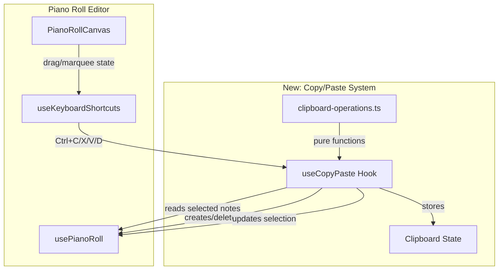

# Design Document: Copy/Paste Notes

## Overview

This feature adds copy, cut, paste, and duplicate operations for notes in the piano roll editor. It introduces an internal application-level clipboard that stores normalized note data (with relative timing offsets) and supports paste at the playhead position with grid-snap awareness.

The implementation follows the existing patterns in the codebase: a custom React hook (`useCopyPaste`) encapsulates clipboard state and operations, integrating with the existing `usePianoRoll` hook for note/selection management and the `useKeyboardShortcuts` pattern for keyboard handling.

**Key design decisions:**
- Internal clipboard (not system clipboard) to avoid browser permission issues and support structured note data
- Relative timing normalization on copy (earliest note = offset 0) enables position-independent pasting
- Operations are pure functions operating on note arrays, making them testable in isolation
- Grid snap is applied to the paste/duplicate anchor position only, preserving relative timing between notes

## Architecture



The copy/paste system is layered:
1. **Pure operation functions** (`clipboard-operations.ts`) — stateless utility functions for normalizing, positioning, and validating note data
2. **Hook** (`useCopyPaste`) — manages clipboard state and orchestrates operations using the pure functions
3. **Integration** — keyboard shortcut handling extended to support Ctrl+C/X/V/D with existing focus and text-input guards

## Components and Interfaces

### ClipboardNote (Data Transfer Type)

```typescript
/**
 * Represents a note stored in the clipboard with relative timing.
 * Offsets are relative to the earliest note in the copied selection.
 */
interface ClipboardNote {
  /** Relative start offset in beats (earliest note = 0) */
  startOffset: number;
  /** MIDI pitch (0-127) */
  pitch: number;
  /** Duration in beats */
  duration: number;
  /** Velocity (0-1) */
  velocity: number;
}
```

### ClipboardState

```typescript
interface ClipboardState {
  /** Stored notes with relative offsets, or null if clipboard is empty */
  notes: ClipboardNote[] | null;
}
```

### clipboard-operations.ts (Pure Functions)

```typescript
/**
 * Normalizes selected notes to relative offsets for clipboard storage.
 * The earliest note gets startOffset = 0.
 */
function normalizeNotesToClipboard(notes: Note[]): ClipboardNote[];

/**
 * Creates new notes from clipboard data at a given anchor position.
 * Applies boundary validation (pitch clamped to 0-127, start clamped to >= 0).
 */
function pasteNotesAtPosition(
  clipboardNotes: ClipboardNote[],
  anchorPosition: number,
  gridSnap: GridSnapConfig
): Note[];

/**
 * Calculates the duplicate anchor position: end time of the latest note
 * in the selection (max of start + duration), snapped if grid snap enabled.
 */
function calculateDuplicateAnchor(
  selectedNotes: Note[],
  gridSnap: GridSnapConfig
): number;

/**
 * Validates and clamps a note's properties to valid ranges.
 */
function validateNoteProperties(note: Note, gridSnap: GridSnapConfig): Note;
```

### useCopyPaste Hook

```typescript
interface UseCopyPasteProps {
  notes: Note[];
  selectedNoteIds: Set<string>;
  playheadPosition: number;
  gridSnap: GridSnapConfig;
  onNotesCreated: (notes: Note[]) => void;
  onNotesDeleted: (noteIds: string[]) => void;
  onSelectionChanged: (noteIds: string[]) => void;
}

interface UseCopyPasteReturn {
  /** Copy selected notes to clipboard */
  copy: () => void;
  /** Cut selected notes (copy + delete) */
  cut: () => void;
  /** Paste clipboard contents at playhead */
  paste: () => void;
  /** Duplicate selected notes after selection end */
  duplicate: () => void;
  /** Whether clipboard has content */
  hasClipboardContent: boolean;
  /** Visual feedback flag (briefly true after copy/cut) */
  showCopyFeedback: boolean;
}
```

### Keyboard Shortcut Integration

The existing `useKeyboardShortcuts` hook will be extended with new callbacks:

```typescript
interface UseKeyboardShortcutsProps {
  // ... existing props
  onCopy?: () => void;
  onCut?: () => void;
  onPaste?: () => void;
  onDuplicate?: () => void;
  /** Whether a drag/resize/marquee operation is in progress */
  isDragging?: boolean;
}
```

The hook will add cases for `KeyC`, `KeyX`, `KeyV`, `KeyD` when the platform modifier key is held, respecting existing text-input and focus guards, plus a new guard for active drag operations.

## Data Models

### Clipboard Storage

The clipboard is stored as React state within the `useCopyPaste` hook. It persists for the duration of the component lifecycle (browser session for SPA).

```typescript
// Internal state shape
const [clipboard, setClipboard] = useState<ClipboardNote[] | null>(null);
```

### Note Creation on Paste/Duplicate

New notes are created using `crypto.randomUUID()` (consistent with existing `PianoRollCanvas` pattern) for ID generation:

```typescript
const newNote: Note = {
  id: crypto.randomUUID(),
  pitch: Math.max(0, Math.min(127, clipboardNote.pitch)),
  start: Math.max(0, anchorPosition + clipboardNote.startOffset),
  duration: Math.max(getMinimumDuration(gridSnap), clipboardNote.duration),
  velocity: Math.max(0, Math.min(1, clipboardNote.velocity)),
};
```

### Operation Flow

1. **Copy**: `selectedNotes → normalizeNotesToClipboard() → clipboard state`
2. **Cut**: Copy flow + delete selected notes + clear selection
3. **Paste**: `clipboard + playheadPosition + gridSnap → pasteNotesAtPosition() → new notes + select them`
4. **Duplicate**: `selectedNotes → normalizeNotesToClipboard() → calculateDuplicateAnchor() → pasteNotesAtPosition() → new notes + select them`

## Correctness Properties

*A property is a characteristic or behavior that should hold true across all valid executions of a system—essentially, a formal statement about what the system should do. Properties serve as the bridge between human-readable specifications and machine-verifiable correctness guarantees.*

### Property 1: Clipboard stores relative timing offsets

*For any* set of selected notes with varying start times, after a copy or cut operation, the clipboard SHALL store each note's start as an offset where the earliest note has offset 0 and all other notes have offset equal to (their original start - minimum start in the selection).

**Validates: Requirements 1.4, 2.1**

### Property 2: No-op when selection is empty

*For any* clipboard state and note state, triggering copy, cut, or duplicate with an empty selection SHALL leave the clipboard contents, notes array, and selection unchanged. Similarly, triggering paste with an empty clipboard SHALL leave notes and selection unchanged.

**Validates: Requirements 1.2, 2.2, 3.6, 4.6**

### Property 3: Cut removes selected notes and clears selection

*For any* set of selected notes, after a cut operation, the piano roll's note array SHALL NOT contain any of the previously selected notes, AND the selection SHALL be empty, AND the clipboard SHALL contain the normalized note data.

**Validates: Requirements 2.1, 2.3**

### Property 4: Paste preserves note data and positions relative to playhead

*For any* non-empty clipboard and any playhead position, pasting SHALL create notes where: the earliest pasted note starts at the (possibly grid-snapped) playhead position, all other pasted notes maintain their original relative offsets from the earliest, and each pasted note preserves its original pitch, duration, and velocity from the clipboard.

**Validates: Requirements 3.1, 3.2**

### Property 5: Paste respects grid snap configuration

*For any* playhead position P and grid snap config G, the effective paste anchor position SHALL equal `snapToGrid(P, G.division)` when G is enabled, and SHALL equal P exactly (quantized to 1/32 beat) when G is disabled.

**Validates: Requirements 3.4, 3.5**

### Property 6: All note-creation operations produce unique IDs

*For any* paste or duplicate operation, every newly created note SHALL have a unique ID that does not collide with any existing note ID or with any other newly created note ID in the same operation.

**Validates: Requirements 3.3, 4.4**

### Property 7: Paste and duplicate select only new notes

*For any* paste or duplicate operation that creates N new notes, the resulting selection SHALL contain exactly those N note IDs and no others.

**Validates: Requirements 3.7, 4.5**

### Property 8: Multiple pastes from same clipboard

*For any* clipboard state, performing N consecutive paste operations SHALL each produce a valid set of new notes from the same clipboard data, and the clipboard SHALL remain unchanged after each paste.

**Validates: Requirements 3.8**

### Property 9: Duplicate positions after selection end and preserves structure

*For any* set of selected notes, after a duplicate operation, the earliest duplicated note SHALL start at the end time (max of start + duration) of the latest note in the original selection (with grid snap applied if enabled), AND the relative timing, pitch, duration, and velocity between duplicated notes SHALL match the relative values between the original notes.

**Validates: Requirements 4.1, 4.2, 4.3**

### Property 10: Clipboard independence (deep copy)

*For any* set of notes that are copied to the clipboard, subsequent modifications (move, resize, delete) to the original notes SHALL NOT affect the clipboard contents. Pasting after modifications SHALL produce notes matching the values at copy time.

**Validates: Requirements 5.1**

### Property 11: Paste validates note boundaries

*For any* paste operation, all created notes SHALL have: pitch clamped to [0, 127], start time clamped to >= 0, and duration clamped to >= minimum grid subdivision.

**Validates: Requirements 5.2, 5.3, 5.4**

### Property 12: Text input suppresses clipboard shortcuts

*For any* keyboard event with Ctrl/Cmd+C/X/V/D where the event target is a text input, textarea, or contenteditable element, the piano roll SHALL NOT trigger clipboard operations and SHALL allow default browser behavior.

**Validates: Requirements 6.1**

### Property 13: Active drag suppresses clipboard shortcuts

*For any* state where a note drag, note resize, or marquee selection is in progress, Ctrl/Cmd+C/X/V/D SHALL NOT trigger clipboard operations.

**Validates: Requirements 6.4**

## Error Handling

| Scenario | Handling |
|----------|----------|
| Paste with empty clipboard | No-op, return early |
| Copy/Cut/Duplicate with empty selection | No-op, return early |
| Pasted note pitch out of MIDI range | Clamp to [0, 127] |
| Pasted note start time negative | Clamp to 0 |
| Pasted note duration <= 0 | Clamp to `getMinimumDuration(gridSnap)` |
| Clipboard shortcuts during drag | Suppress, do not process |
| Shortcuts when piano roll not focused | Ignore, allow default browser behavior |
| Shortcuts in text input | Ignore, allow default browser behavior |

No user-facing error messages are needed — all edge cases result in graceful no-ops or value clamping.

## Testing Strategy

### Property-Based Tests (using fast-check)

The core clipboard operations are pure functions with clear input/output behavior, making them excellent candidates for property-based testing. Each property test will:
- Run a minimum of 100 iterations
- Use custom arbitraries for `Note` and `ClipboardNote` generation
- Be tagged with the corresponding design property

**Library**: `fast-check` (already suitable for the TypeScript/Jest ecosystem)

**Tag format**: `Feature: copy-paste-notes, Property {N}: {description}`

Property tests will cover:
- `normalizeNotesToClipboard` — Properties 1, 10
- `pasteNotesAtPosition` — Properties 4, 5, 6, 11
- `calculateDuplicateAnchor` — Property 9
- Copy/Cut/Paste/Duplicate operation logic — Properties 2, 3, 7, 8, 12, 13

### Unit Tests (example-based)

Unit tests complement property tests for specific scenarios:
- Visual feedback timing (Requirement 1.5)
- `preventDefault` called on handled shortcuts (Requirement 6.3)
- Clipboard retention across session (Requirements 1.3, 2.4)
- Integration between `useCopyPaste` and `usePianoRoll` hooks

### Integration Tests

- End-to-end keyboard shortcut flow: select notes → Ctrl+C → move playhead → Ctrl+V → verify new notes at playhead
- Cut → paste workflow with selection state transitions
- Duplicate with grid snap enabled/disabled
- Interaction with existing shortcuts (Delete, Space, Ctrl+A) to verify no conflicts
