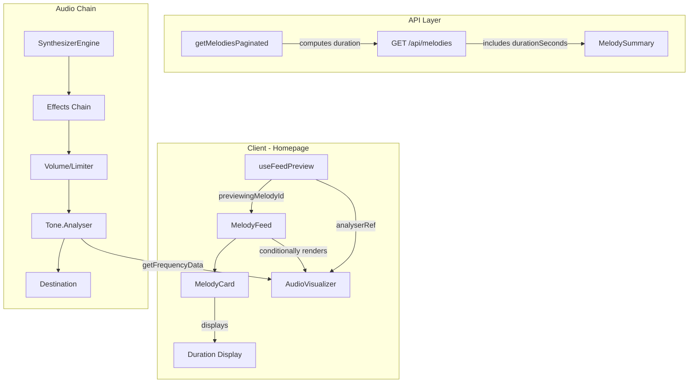

# Design Document: Homepage Visualizer

## Overview

This feature adds two visual enhancements to the homepage melody feed:

1. **Duration Display** — A text element on each MelodyCard showing the total melody length (e.g., "1:23"), computed server-side and delivered via the existing API.
2. **Audio Visualizer** — A canvas-based frequency bar animation that appears below the actively playing MelodyCard, driven by real-time audio data from a Tone.js Analyser node.

Both enhancements are scoped exclusively to the homepage feed (`/` route). The duration display is a static data addition, while the visualizer is a dynamic rendering component tied to the existing `useFeedPreview` playback lifecycle.

### Key Design Decisions

| Decision | Rationale |
|----------|-----------|
| Compute duration server-side in the API | Avoids fetching full note data for each card; keeps MelodySummary lightweight |
| Use HTML Canvas for visualizer | Avoids per-frame DOM mutations; GPU-accelerated drawing for smooth 60fps |
| Connect Analyser at end of audio chain | Ensures visualized data reflects post-effects output (what user actually hears) |
| IntersectionObserver for animation pause | Prevents off-screen rendering from consuming CPU/GPU resources |
| Expose analyser via ref from useFeedPreview | Avoids prop-drilling; visualizer reads data directly on each rAF tick |

## Architecture



### Data Flow

1. **Duration**: `getMelodiesPaginated` → SQL query computes `durationSeconds` per melody → returned in API response → `MelodyCard` renders formatted string.
2. **Visualizer**: `useFeedPreview` creates `Tone.Analyser` → connected after limiter in audio chain → `AudioVisualizer` component reads frequency bins via ref on each `requestAnimationFrame` tick → draws bars to canvas.

## Components and Interfaces

### Modified: `MelodySummary` Type

```typescript
// types/melody.ts
export interface MelodySummary {
  id: string;
  title: string;
  createdAt: string;
  durationSeconds: number; // NEW: total duration in seconds, rounded to 2 decimal places
}
```

### New: `formatDuration` Utility

```typescript
// utils/duration.ts

/**
 * Format a duration in seconds to a human-readable string.
 * - < 60s: "0:SS" (e.g., "0:05")
 * - 60s to < 3600s: "M:SS" (e.g., "1:05")
 * - >= 3600s: "H:MM:SS" (e.g., "1:02:30")
 *
 * Returns "0:00" for invalid inputs (undefined, null, negative, zero).
 */
export function formatDuration(durationSeconds: number | null | undefined): string;
```

### Modified: `MelodyCard` Component

Adds a duration line between title and date:

```typescript
// components/MelodyCard.tsx (additions to props)
export interface MelodyCardProps {
  melody: MelodySummary; // now includes durationSeconds
  // ... existing props unchanged
}
```

The card renders the formatted duration using `formatDuration(melody.durationSeconds)` in a `<p>` element styled to match the creation date text weight.

### New: `AudioVisualizer` Component

```typescript
// components/AudioVisualizer.tsx

export interface AudioVisualizerProps {
  /** Reference to the Tone.Analyser node for reading frequency data */
  analyserRef: React.RefObject<Tone.Analyser | null>;
  /** Number of frequency bars to display (16-32) */
  barCount?: number;
}

/**
 * Canvas-based audio visualizer rendering frequency bars.
 * Uses requestAnimationFrame for smooth animation.
 * Pauses when scrolled off-screen via IntersectionObserver.
 * Accessibility: aria-hidden="true", tabindex="-1", no ARIA roles.
 */
export function AudioVisualizer({ analyserRef, barCount = 32 }: AudioVisualizerProps): JSX.Element;
```

### Modified: `useFeedPreview` Hook

```typescript
// hooks/useFeedPreview.ts (additions to return type)
export interface UseFeedPreviewReturn {
  // ... existing fields ...
  /** Ref to the Tone.Analyser node for visualizer data access */
  analyserRef: React.RefObject<Tone.Analyser | null>;
}
```

The hook creates a `Tone.Analyser` with FFT size 64 and connects it at the end of the audio chain (after the limiter, before destination). On disposal, the analyser is always disconnected and disposed regardless of other disposal errors.

### Modified: `MelodyFeed` Component

Conditionally renders `<AudioVisualizer>` below the currently playing `MelodyCard`:

```typescript
// Within the melody list mapping:
{melodies.map((melody) => (
  <React.Fragment key={melody.id}>
    <MelodyCard ... />
    {previewingMelodyId === melody.id && (
      <AudioVisualizer analyserRef={analyserRef} />
    )}
  </React.Fragment>
))}
```

### Modified: `getMelodiesPaginated` (Data Layer)

```sql
-- Updated query to compute duration
SELECT
  id,
  title,
  created_at,
  CASE
    WHEN tempo <= 0 OR jsonb_array_length(notes) = 0 THEN 0
    ELSE ROUND(
      (SELECT MAX((elem->>'start')::numeric + (elem->>'duration')::numeric)
       FROM jsonb_array_elements(notes) AS elem
      ) / tempo * 60, 2
    )
  END AS duration_seconds
FROM melodies
ORDER BY created_at DESC
LIMIT $1 OFFSET $2
```

Alternatively, duration can be computed in the `rowToMelodySummary` mapping function in TypeScript for testability:

```typescript
// lib/duration.ts
export function computeMelodyDuration(notes: Note[], tempo: number): number {
  if (notes.length === 0 || tempo <= 0) return 0;
  const maxEndBeat = Math.max(...notes.map(n => n.start + n.duration));
  const seconds = (maxEndBeat / tempo) * 60;
  return Math.round(seconds * 100) / 100; // round to 2 decimal places
}
```

## Data Models

### Updated MelodySummary

| Field | Type | Description |
|-------|------|-------------|
| id | string | UUID v4 |
| title | string | Melody title |
| createdAt | string | ISO 8601 timestamp |
| durationSeconds | number | Total melody duration in seconds (2 decimal places) |

### AudioVisualizer Internal State

| State | Type | Description |
|-------|------|-------------|
| canvasRef | RefObject\<HTMLCanvasElement\> | Reference to the canvas DOM element |
| animationFrameId | number \| null | Current rAF callback ID for cleanup |
| isVisible | boolean | Whether the component is in the viewport (from IntersectionObserver) |

### Tone.Analyser Configuration

| Parameter | Value | Description |
|-----------|-------|-------------|
| type | "fft" | Fast Fourier Transform mode |
| size | 64 | FFT size producing 32 frequency bins |
| smoothing | 0.8 | Temporal smoothing for visual stability |

The analyser output is a `Float32Array` of 32 values in dB scale, which the visualizer normalizes to 0-255 range (Uint8 equivalent) for bar height calculation.

## Correctness Properties

*A property is a characteristic or behavior that should hold true across all valid executions of a system — essentially, a formal statement about what the system should do. Properties serve as the bridge between human-readable specifications and machine-verifiable correctness guarantees.*

### Property 1: Duration Computation Correctness

*For any* non-empty array of notes with positive start and duration values, and *for any* positive tempo value, the computed `durationSeconds` SHALL equal `Math.round((Math.max(...notes.map(n => n.start + n.duration)) / tempo * 60) * 100) / 100`, and for empty notes or non-positive tempo the result SHALL be 0.

**Validates: Requirements 1.1, 1.2, 1.3, 1.4**

### Property 2: Duration Formatting Decomposition

*For any* non-negative number of seconds, the formatted duration string SHALL correctly decompose the value into its hours, minutes, and seconds components such that parsing the formatted string back yields the original floored-second value. Specifically:
- The seconds component (last two characters) equals `Math.floor(totalSeconds) % 60`
- The minutes component equals `Math.floor(totalSeconds / 60) % 60`
- The hours component (if present) equals `Math.floor(totalSeconds / 3600)`

**Validates: Requirements 2.2, 2.3, 2.4, 2.5**

### Property 3: Invalid Duration Guard

*For any* value that is undefined, null, negative, or zero, the `formatDuration` function SHALL return the string "0:00", regardless of the value's magnitude or type.

**Validates: Requirements 2.6**

### Property 4: Bar Height Proportional Scaling

*For any* frequency amplitude value in the range [0, 255] and *for any* visualizer height in the range [32, 48] pixels, the rendered bar height SHALL equal `(amplitude / 255) * visualizerHeight`, where amplitude 0 produces height 0 and amplitude 255 produces full visualizer height.

**Validates: Requirements 3.7, 3.8**

## Error Handling

| Scenario | Handling Strategy |
|----------|-------------------|
| Melody has no notes (duration = 0) | Return `durationSeconds: 0`, display "0:00" |
| Tempo is 0 or negative | Return `durationSeconds: 0`, display "0:00" |
| `durationSeconds` missing from API response | `formatDuration` handles undefined → "0:00" |
| Tone.Analyser fails to initialize | Visualizer does not render; feed works normally without it |
| Canvas context unavailable | Visualizer silently skips rendering; no error propagated to user |
| requestAnimationFrame frame exceeds 16ms | Skip visual update, proceed to next frame (no queue buildup) |
| Synth disposal throws during cleanup | Wrap analyser disposal in try/finally to guarantee cleanup |
| User navigates away during playback | React unmount triggers cleanup: cancel rAF, disconnect analyser |
| IntersectionObserver not supported | Fallback: always animate (no pause optimization) |

## Testing Strategy

### Unit Tests (Vitest + Testing Library)

**Duration computation (`lib/duration.ts`):**
- Correct formula application with known inputs
- Zero notes → 0
- Zero/negative tempo → 0
- Rounding to 2 decimal places

**Duration formatting (`utils/duration.ts`):**
- Seconds-only range (0:05, 0:42, 0:59)
- Minutes range (1:00, 1:05, 12:30, 59:59)
- Hours range (1:00:00, 1:02:30)
- Invalid inputs (null, undefined, -1, 0) → "0:00"

**AudioVisualizer component:**
- Renders canvas with aria-hidden="true" and tabindex="-1"
- No ARIA live regions or roles in rendered output
- Correct canvas height (48px)

**MelodyCard component:**
- Duration displayed between title and date
- Correct formatting for various durationSeconds values

### Property-Based Tests (fast-check + Vitest)

Property-based tests use the `fast-check` library already in devDependencies.

Each property test runs a minimum of **100 iterations**.

**Configuration:**
- Library: `fast-check` v4.x
- Runner: `vitest`
- Iterations: 100+ per property
- Tag format: `Feature: homepage-visualizer, Property {N}: {title}`

**Property tests to implement:**

1. **Duration computation** — Generate random note arrays and tempos, verify formula
2. **Duration formatting** — Generate random non-negative seconds, verify decomposition
3. **Invalid duration guard** — Generate invalid inputs, verify "0:00" output
4. **Bar height scaling** — Generate random amplitudes and heights, verify proportional calculation

### Integration Tests

- API endpoint returns `durationSeconds` field in melody summaries
- Visualizer receives real frequency data when connected to playing synth
- Visualizer cleanup on navigation (rAF cancelled, analyser disposed)

### Accessibility Tests

- Screen reader announcements for playing state not disrupted by visualizer
- Visualizer excluded from tab order and accessibility tree
