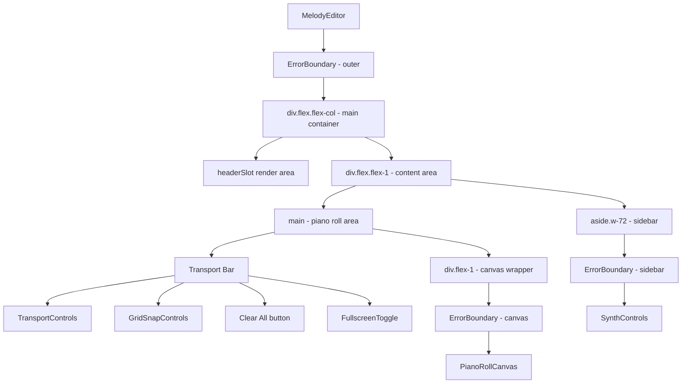
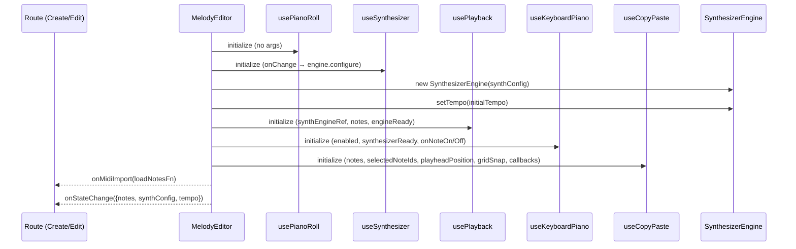

# Design Document: Melody Editor Refactor

## Overview

This feature refactors the duplicated piano roll editor logic from `app/create/page.tsx` and `app/m/[id]/MelodyEditor.tsx` into a single shared `MelodyEditor` component in `components/`. Both pages currently duplicate ~300 lines of hook initialization, event handler wrappers, transport bar rendering, canvas rendering, fullscreen management, and synth sidebar. The Create page additionally lacks copy/paste support that the Edit page has.

The shared component encapsulates:
- Hook initialization (`usePianoRoll`, `useSynthesizer`, `usePlayback`, `useKeyboardPiano`, `useCopyPaste`)
- `SynthesizerEngine` lifecycle (create on mount, configure, dispose on unmount)
- Transport bar (playback, grid snap, clear-all, fullscreen toggle)
- `PianoRollCanvas` with all event handler wiring
- Synth controls sidebar
- Fullscreen state management
- Dirty state tracking

Route-specific logic (save dialogs, delete confirmation, ownership checks, preview mode) remains in the consuming pages, injected via props and slots.

## Architecture

```mermaid
graph TD
    subgraph Routes
        CP[Create Page<br/>/create]
        EP[Edit Page<br/>/m/:id]
    end

    subgraph SharedComponent["MelodyEditor (components/)"]
        HOOKS[Hook Layer<br/>usePianoRoll, useSynthesizer,<br/>usePlayback, useKeyboardPiano,<br/>useCopyPaste]
        ENGINE[SynthesizerEngine<br/>lifecycle management]
        UI[UI Layer<br/>TransportBar, PianoRollCanvas,<br/>SynthControls sidebar]
        FS[Fullscreen Manager]
        DIRTY[Dirty State Tracker]
    end

    CP -->|initialNotes=[], initialTempo=120,<br/>headerSlot, onStateChange| SharedComponent
    EP -->|initialNotes, initialSynthConfig,<br/>initialTempo, readOnly,<br/>headerSlot, onStateChange,<br/>onDirtyStateChange| SharedComponent

    HOOKS --> ENGINE
    HOOKS --> UI
    UI --> FS
    HOOKS --> DIRTY
```

### Design Decisions

1. **Composition over inheritance**: The shared component uses a slot-based approach (`headerSlot`) rather than inheritance or render props, keeping the API simple and React-idiomatic.

2. **Internal state ownership**: The shared component owns all editor state (notes, synth config, tempo, playback, selection). Parents only receive state via callbacks (`onStateChange`, `onDirtyStateChange`). This avoids complex two-way binding.

3. **Imperative escape hatch for MIDI import**: The `onMidiImport` callback exposes the internal `loadNotes` function reference so the parent can wire it to `MidiControls` rendered in the `headerSlot`. This is necessary because the parent owns the header rendering but the shared component owns the note state.

4. **readOnly as a behavior gate**: Rather than conditionally rendering different sub-trees, `readOnly` disables mutation operations at the handler level, keeping the render tree stable for smoother transitions between owner/viewer modes.

## Components and Interfaces

### MelodyEditor Props

```typescript
interface MelodyEditorProps {
  /** Pre-existing notes to load on mount. Defaults to []. */
  initialNotes?: Note[];

  /** Pre-existing synth config to load on mount. Defaults to DEFAULT_SYNTH_CONFIG. */
  initialSynthConfig?: SynthesizerConfig;

  /** Starting tempo in BPM (20-300). Defaults to 120. */
  initialTempo?: number;

  /** When true, disables note CRUD, clear-all, synth changes, MIDI import.
   *  Playback, grid snap, and fullscreen remain functional. */
  readOnly?: boolean;

  /** React node rendered in the header area (e.g., save button, title). */
  headerSlot?: React.ReactNode;

  /** Whether MIDI import is allowed. Defaults to true.
   *  When false, loadNotes calls from onMidiImport are ignored. */
  allowMidiImport?: boolean;

  /** Fired whenever notes, synthConfig, or tempo change. */
  onStateChange?: (state: EditorState) => void;

  /** Fired with true when state is modified after initialization/last reset. */
  onDirtyStateChange?: (isDirty: boolean) => void;

  /** Provides the loadNotes function to the parent for MIDI import wiring. */
  onMidiImport?: (loadNotes: LoadNotesFn) => void;
}

interface EditorState {
  notes: Note[];
  synthConfig: SynthesizerConfig;
  tempo: number;
}

type LoadNotesFn = (notes: Note[], tempo?: number) => void;
```

### Internal Component Structure



### Hook Wiring Diagram



## Data Models

### Core Types (existing, unchanged)

```typescript
// types/note.ts
interface Note {
  id: string;          // UUID v4
  pitch: number;       // MIDI 0-127
  start: number;       // beats >= 0
  duration: number;    // beats >= 0.001
  velocity: number;    // 0-1
}

// types/synth.ts
interface SynthesizerConfig {
  oscillatorType: OscillatorType;
  volume: number;
  envelope: ADSREnvelope;
  filter: FilterConfig;
  effects: EffectsConfig;
  presetName: PresetName | null;
}

// types/grid.ts
interface GridSnapConfig {
  enabled: boolean;
  division: GridDivision;
}
```

### New Types (introduced by this feature)

```typescript
// components/MelodyEditor/types.ts

/** State snapshot emitted via onStateChange */
interface EditorState {
  notes: Note[];
  synthConfig: SynthesizerConfig;
  tempo: number;
}

/** Function type for MIDI import */
type LoadNotesFn = (notes: Note[], tempo?: number) => void;
```

### State Flow

| State | Owner | Consumers |
|-------|-------|-----------|
| notes, selectedNoteIds, selectionAnchor, gridSnap | usePianoRoll (inside ME) | PianoRollCanvas, useCopyPaste, onStateChange |
| synthConfig | useSynthesizer (inside ME) | SynthControls, SynthesizerEngine, onStateChange |
| tempo | useState (inside ME) | TransportControls, SynthControls, SynthesizerEngine, onStateChange |
| isPlaying, isPaused, isLooping, playheadPosition | usePlayback (inside ME) | TransportControls, PianoRollCanvas, useCopyPaste |
| isPianoRollFullscreen | useState (inside ME) | layout CSS, sidebar visibility |
| highlightedPitch, activePitches | useKeyboardPiano (inside ME) | PianoRollCanvas |
| copy, cut, paste, duplicate | useCopyPaste (inside ME) | PianoRollCanvas |
| isDirty | tracked via ref (inside ME) | onDirtyStateChange callback |

## Correctness Properties

*A property is a characteristic or behavior that should hold true across all valid executions of a system — essentially, a formal statement about what the system should do. Properties serve as the bridge between human-readable specifications and machine-verifiable correctness guarantees.*

### Property 1: Initialization Preserves Provided State

*For any* valid initial notes array, valid SynthesizerConfig, and valid tempo in [20, 300], when the MelodyEditor mounts with these as `initialNotes`, `initialSynthConfig`, and `initialTempo`, the first `onStateChange` emission SHALL contain those exact values (notes by deep equality, synthConfig by deep equality, tempo by value equality).

**Validates: Requirements 2.1, 2.2, 2.3**

### Property 2: State Change Callback Fires on Any Mutation

*For any* editor state and any mutation operation (note create, note update, note delete, clear all, MIDI import, synth config change, tempo change), the `onStateChange` callback SHALL be invoked with an `EditorState` object reflecting the new state after the mutation is applied.

**Validates: Requirements 2.4, 9.4**

### Property 3: ReadOnly Blocks All Mutations

*For any* editor state and any mutation operation (note create, note update, note delete, clear all, synth config change, MIDI import) attempted while `readOnly` is true, the editor state SHALL remain unchanged and `onStateChange` SHALL NOT be invoked.

**Validates: Requirements 2.5, 5.7, 7.5**

### Property 4: Title Validation Rejects Invalid Input

*For any* string that is either empty, composed entirely of whitespace, or longer than 200 characters, the Create page save dialog SHALL reject the input and prevent persistence. *For any* string that is non-empty, contains at least one non-whitespace character, and is at most 200 characters, the save SHALL proceed.

**Validates: Requirements 3.3**

### Property 5: MIDI Import Replaces All State

*For any* array of valid notes and optional tempo value, when MIDI import is triggered (with `allowMidiImport=true` and `readOnly=false`), the resulting editor state SHALL contain exactly the imported notes (replacing all previous notes) and, if a tempo was provided, the tempo SHALL equal the imported value.

**Validates: Requirements 7.3**

### Property 6: allowMidiImport=false Blocks Import

*For any* editor state and any array of notes to import, when `allowMidiImport` is false, invoking the MIDI import function SHALL leave notes and tempo unchanged.

**Validates: Requirements 7.4**

### Property 7: Dirty State Fires on Any Mutation

*For any* mutation operation (note create, note update, note delete, clear all, MIDI import, synth config change, tempo change), `onDirtyStateChange` SHALL be invoked with `true` after the operation completes.

**Validates: Requirements 8.1, 8.2, 8.3**

### Property 8: Tempo Change Propagates to Engine

*For any* valid tempo value in [20, 300], when the user changes the tempo via SynthControls, the SynthesizerEngine's `setTempo` method SHALL be called with exactly that tempo value.

**Validates: Requirements 9.2**

## Error Handling

| Scenario | Handling |
|----------|----------|
| SynthesizerEngine fails to initialize | ErrorBoundary catches and displays fallback UI |
| PianoRollCanvas throws during render | Canvas ErrorBoundary shows "Canvas Error" message without affecting transport/sidebar |
| SynthControls throws during render | Sidebar ErrorBoundary shows "Controls Error" message without affecting canvas |
| onStateChange callback throws | Caught internally; does not crash the editor |
| Invalid initialNotes (malformed notes) | Passed through to usePianoRoll which applies validation clamps |
| Invalid initialTempo (out of range) | Clamped to [20, 300] before applying |
| Engine dispose called during playback | usePlayback stops playback before engine disposal |

## Testing Strategy

### Unit Tests (Example-Based)

- Rendering: Verify layout structure, CSS classes, conditional rendering (fullscreen, readOnly, sidebar visibility)
- Slot rendering: `headerSlot` content appears in header area
- Prop defaults: Component works with no optional props (empty notes, default tempo, default synth)
- Keyboard interaction: Escape exits fullscreen
- Integration: Create page save dialog flow, Edit page ownership-based rendering

### Property-Based Tests

Property-based testing is appropriate here because the shared component has clear input/output relationships (props → state → callbacks) with a large input space (arbitrary note arrays, synth configs, tempo values, operation sequences).

**Library**: [fast-check](https://github.com/dubzzz/fast-check) (already compatible with the project's TypeScript/Jest setup)

**Configuration**:
- Minimum 100 iterations per property test
- Each test tagged with: `Feature: melody-editor-refactor, Property {N}: {title}`

**Properties to implement**:
1. Initialization preserves state (Property 1)
2. State change callback fires on mutation (Property 2)
3. ReadOnly blocks mutations (Property 3)
4. Title validation (Property 4)
5. MIDI import replaces state (Property 5)
6. allowMidiImport=false blocks import (Property 6)
7. Dirty state fires on mutation (Property 7)
8. Tempo propagates to engine (Property 8)

### Integration Tests

- Create page: full save flow (open dialog → enter title → confirm → API call → redirect)
- Edit page: ownership detection → readOnly vs editable mode
- Edit page: save success indicator with 3-second timeout
- Edit page: delete confirmation → API call → redirect
- MIDI import/export round-trip through MidiControls
- SynthesizerEngine lifecycle (mount → configure → dispose)

### Snapshot/Regression Tests

- Transport bar structure comparison with existing Create page and Edit page implementations
- CSS class verification against current implementation
