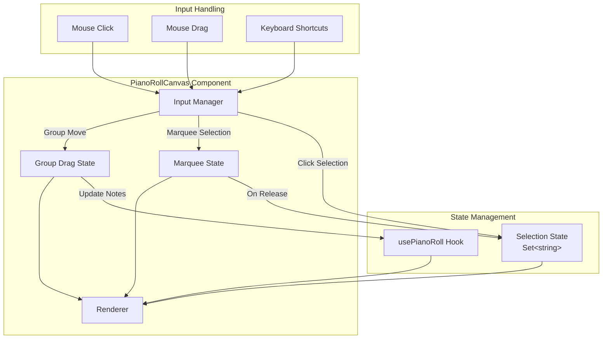
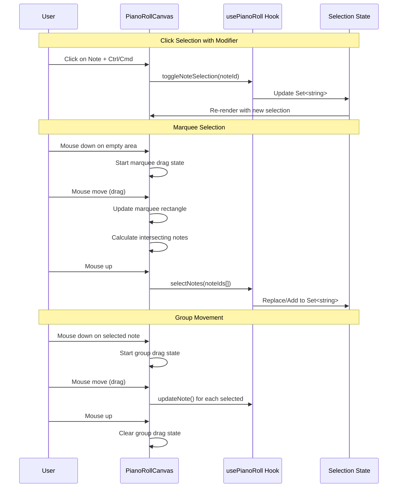

# Design Document: Multi-Note Selection

## Overview

This design document outlines the implementation of multi-note selection functionality for the Tone Sketch piano roll editor. The feature transforms the existing single-selection model into a comprehensive multi-selection system, enabling users to select, manipulate, and delete multiple notes simultaneously.

### Goals

1. **Seamless Transition**: Migrate from single selection (`selectedNoteId: string | null`) to multi-selection (`selectedNoteIds: Set<string>`) with backward-compatible behavior
2. **Intuitive Selection Methods**: Support click-to-select with modifier keys (Ctrl/Cmd for toggle, Shift for range) and marquee rectangle selection
3. **Group Operations**: Enable batch movement and deletion of selected notes while preserving relative positions
4. **Visual Clarity**: Provide clear visual feedback for selected notes and selection rectangles
5. **Keyboard Efficiency**: Support keyboard shortcuts (Delete/Backspace, Ctrl+A/Cmd+A) for common operations

### Design Rationale

The design leverages existing patterns in the codebase:
- Extends the current `DragState` pattern to support group movement
- Reuses existing visual styles (`NOTE_SELECTED_COLOR`, `NOTE_SELECTED_BORDER_COLOR`)
- Builds on the `useKeyboardShortcuts` hook architecture
- Maintains the established canvas rendering pipeline

## Architecture

### High-Level Architecture



### Component Interaction Flow



## Components and Interfaces

### Modified: `usePianoRoll` Hook

**Current State (Single Selection)**:
```typescript
selectedNoteId: string | null;
selectNote: (noteId: string | null) => void;
```

**New State (Multi-Selection)**:
```typescript
interface UsePianoRollReturn {
  // ... existing properties

  /** Set of currently selected note IDs */
  selectedNoteIds: Set<string>;

  /** Select a single note (clears previous selection) */
  selectNote: (noteId: string | null) => void;

  /** Select multiple notes at once (replaces selection) */
  selectNotes: (noteIds: string[]) => void;

  /** Add notes to current selection */
  addToSelection: (noteIds: string[]) => void;

  /** Remove a note from selection */
  deselectNote: (noteId: string) => void;

  /** Toggle a note's selection state */
  toggleNoteSelection: (noteId: string) => void;

  /** Clear all selections */
  deselectAll: () => void;

  /** Select all notes in the melody */
  selectAll: () => void;
}
```

### Modified: `PianoRollCanvasProps`

```typescript
interface PianoRollCanvasProps {
  // ... existing properties

  /** IDs of currently selected notes (replaces selectedNoteId) */
  selectedNoteIds?: Set<string>;

  /** Callback when selection changes */
  onSelectionChange?: (selectedIds: Set<string>) => void;

  /** Callback when notes are selected (single or multiple) */
  onNoteSelect?: (noteId: string | null, modifiers: SelectionModifiers) => void;
}

interface SelectionModifiers {
  ctrlOrCmd: boolean;  // Ctrl (Windows/Linux) or Cmd (macOS)
  shift: boolean;
}
```

### New: `MarqueeState` Interface

```typescript
/**
 * State for tracking marquee (rectangle) selection operations
 */
interface MarqueeState {
  /** Starting position of the marquee in pixels */
  startX: number;
  startY: number;

  /** Current position of the marquee in pixels */
  currentX: number;
  currentY: number;

  /** Note IDs that were selected before the marquee started (for additive mode) */
  previousSelection: Set<string>;

  /** Whether modifier key was held (for additive selection) */
  isAdditive: boolean;
}
```

### Extended: `DragState` Interface

```typescript
/**
 * Extended drag state to support group operations
 */
interface DragState {
  /** The primary note being dragged (for single or as anchor for group) */
  note: Note;

  /** Original state of the primary note before drag started */
  originalNote: Note;

  /** Original states of ALL selected notes before drag started (for group move) */
  originalSelectedNotes: Map<string, Note>;

  /** Starting X position of the drag in pixels */
  startX: number;

  /** Starting Y position of the drag in pixels */
  startY: number;

  /** Mode of the drag operation */
  mode: 'move' | 'resize';

  /** Whether this is a group operation (multiple notes selected) */
  isGroupDrag: boolean;
}
```

### Modified: `useKeyboardShortcuts` Hook

```typescript
interface UseKeyboardShortcutsProps {
  enabled: boolean;
  onTogglePlayback: () => void;
  onDeleteNote: () => void;
  onSelectAll?: () => void;  // New: Ctrl+A/Cmd+A handler
  containerRef: RefObject<HTMLElement | null>;
}
```

### New: Selection Utility Functions

```typescript
/**
 * Checks if the platform-appropriate modifier key is pressed
 * Returns true for Cmd on macOS, Ctrl on Windows/Linux
 */
function isPlatformModifierKey(event: MouseEvent | KeyboardEvent): boolean;

/**
 * Gets the range of notes between two notes by start time
 * Used for Shift-click range selection
 */
function getNoteRange(
  notes: Note[],
  anchorNoteId: string,
  targetNoteId: string
): string[];

/**
 * Finds all notes that intersect with a rectangle (for marquee selection)
 */
function getNotesInRect(
  notes: Note[],
  rect: { startBeat: number; endBeat: number; startPitch: number; endPitch: number },
  visibleRegion: VisibleRegion
): string[];

/**
 * Calculates group movement constraints to keep all notes in valid bounds
 */
function calculateGroupMoveConstraints(
  selectedNotes: Note[],
  deltaBeat: number,
  deltaPitch: number
): { constrainedDeltaBeat: number; constrainedDeltaPitch: number };
```

## Data Models

### Selection State

The selection state is represented as a `Set<string>` containing note IDs:

```typescript
// In usePianoRoll hook
const [selectedNoteIds, setSelectedNoteIds] = useState<Set<string>>(new Set());
```

**Rationale for `Set<string>`:**
1. O(1) lookup for checking if a note is selected
2. Automatic deduplication
3. Easy iteration for batch operations
4. Efficient add/remove operations

### Marquee Rectangle

During marquee selection, the rectangle is tracked in pixel coordinates and converted to beat/pitch coordinates for intersection testing:

```typescript
interface MarqueeRect {
  // Pixel coordinates (for rendering)
  x: number;
  y: number;
  width: number;
  height: number;

  // Beat/pitch coordinates (for intersection testing)
  startBeat: number;
  endBeat: number;
  startPitch: number;
  endPitch: number;
}
```

### Group Drag Tracking

For group movement, we track the original positions of all selected notes:

```typescript
// Map from note ID to original Note state
originalSelectedNotes: Map<string, Note>
```

This enables:
1. Restoring all notes to original positions on Escape
2. Calculating relative deltas for each note during drag
3. Constraint checking across all selected notes

### Selection Anchor

For Shift-click range selection, we track the anchor note:

```typescript
// The last note that was clicked (not Shift-clicked)
// Used as the anchor point for range selection
const [selectionAnchor, setSelectionAnchor] = useState<string | null>(null);
```

## Correctness Properties

*A property is a characteristic or behavior that should hold true across all valid executions of a system—essentially, a formal statement about what the system should do. Properties serve as the bridge between human-readable specifications and machine-verifiable correctness guarantees.*

### Property 1: Simple Click Clears and Selects Single Note

*For any* set of notes and any existing selection state, when a user clicks on a note without modifier keys, the resulting selection SHALL contain exactly one note ID—the clicked note's ID.

**Validates: Requirements 1.1**

### Property 2: Click on Empty Clears Selection

*For any* non-empty selection state, when a user clicks on an empty grid position (no note present) without modifier keys, the resulting selection SHALL be an empty set.

**Validates: Requirements 1.2**

### Property 3: Ctrl/Cmd Click Toggles Selection

*For any* note and any existing selection state:
- If the note is NOT in the selection, Ctrl/Cmd-clicking it SHALL result in a selection that equals the previous selection plus the clicked note
- If the note IS in the selection, Ctrl/Cmd-clicking it SHALL result in a selection that equals the previous selection minus the clicked note

**Validates: Requirements 1.3, 1.4**

### Property 4: Shift-Click Range Selection

*For any* set of notes sorted by start time, when a selection anchor exists and a user Shift-clicks on a different note, the resulting selection SHALL contain all notes whose start times fall between (inclusive) the anchor note's start time and the clicked note's start time.

**Validates: Requirements 1.5**

### Property 5: Marquee Note Intersection

*For any* rectangle defined by (startBeat, endBeat, startPitch, endPitch) and any set of notes, a note intersects the rectangle if and only if:
- `note.start < endBeat` AND `note.start + note.duration > startBeat` AND
- `note.pitch >= startPitch` AND `note.pitch < endPitch`

**Validates: Requirements 2.2**

### Property 6: Marquee Selection Replace Mode

*For any* initial selection state and any marquee rectangle, when the marquee is completed without modifier keys, the resulting selection SHALL equal exactly the set of note IDs that intersect with the marquee rectangle.

**Validates: Requirements 2.3**

### Property 7: Marquee Selection Additive Mode

*For any* initial selection state and any marquee rectangle, when the marquee is completed with Ctrl/Cmd held, the resulting selection SHALL equal the union of the initial selection and the set of note IDs that intersect with the marquee rectangle.

**Validates: Requirements 2.4**

### Property 8: Marquee Cancel Restores State

*For any* initial selection state, when a marquee selection is started and then cancelled (Escape key), the resulting selection SHALL equal exactly the initial selection state before the marquee began.

**Validates: Requirements 2.5**

### Property 9: Selection Persists Across View Changes

*For any* selection state and any visible region change (scroll or zoom), the selection state SHALL remain unchanged—the same set of note IDs SHALL be selected after the view change as before.

**Validates: Requirements 3.3**

### Property 10: Group Movement Preserves Relative Positions

*For any* set of selected notes with positions (start, pitch) and any drag delta (deltaBeat, deltaPitch), after group movement:
- For each pair of notes (A, B), the relative difference `(A.start - B.start, A.pitch - B.pitch)` SHALL be identical before and after the move

**Validates: Requirements 4.1**

### Property 11: Group Movement Grid Snap Consistency

*For any* set of selected notes with grid snap enabled, when dragging by delta D:
- The primary (dragged) note's new start time SHALL be snapped to the grid
- All other selected notes SHALL be moved by the same beat delta as the primary note

**Validates: Requirements 4.2**

### Property 12: Group Movement Pitch Delta Uniformity

*For any* set of selected notes and any vertical drag, all selected notes SHALL have their pitch changed by the same integer delta value.

**Validates: Requirements 4.3**

### Property 13: Group Movement Boundary Constraint

*For any* set of selected notes and any drag delta, if applying the delta would cause ANY note to exceed bounds (start < 0 or pitch outside [0, 127]):
- The delta SHALL be constrained such that ALL notes remain within valid bounds
- No note SHALL have start < 0
- No note SHALL have pitch < 0 or pitch > 127

**Validates: Requirements 4.4, 4.5, 4.6**

### Property 14: Group Drag Cancel Restores All Notes

*For any* group drag operation, when cancelled via Escape key, ALL selected notes SHALL be restored to their exact original positions (start, pitch) from before the drag started.

**Validates: Requirements 4.7**

### Property 15: Group Deletion Removes All Selected Notes

*For any* set of notes with a subset selected, when group deletion is triggered (Delete/Backspace key or right-click on selected note):
- All notes in the selection SHALL be removed from the melody
- All notes NOT in the selection SHALL remain in the melody unchanged

**Validates: Requirements 5.1, 5.2**

### Property 16: Right-Click on Unselected Deletes Only Clicked Note

*For any* set of notes with a selection that does NOT include a particular note N, when the user right-clicks on note N:
- Only note N SHALL be removed from the melody
- All selected notes SHALL remain in the melody (selection unchanged)

**Validates: Requirements 5.3**

### Property 17: Selection Cleared After Deletion

*For any* group deletion operation, after the deletion completes, the selection SHALL be an empty set.

**Validates: Requirements 5.4**

### Property 18: Select All Selects Entire Melody

*For any* non-empty set of notes in the melody, when Select All (Ctrl+A/Cmd+A) is triggered, the resulting selection SHALL contain exactly all note IDs in the melody.

**Validates: Requirements 6.1**

### Property 19: Note Deletion Cleans Selection

*For any* note that is currently in the selection, when that note is deleted from the melody (by any means), the note's ID SHALL be removed from the selection.

**Validates: Requirements 7.2**

### Property 20: Bulk Operations Clear Selection

*For any* selection state, when `loadNotes()` or `clearNotes()` is called, the resulting selection SHALL be an empty set.

**Validates: Requirements 7.3**


## Error Handling

### Invalid Selection States

| Scenario | Handling |
|----------|----------|
| Selection contains ID of deleted note | Automatically remove ID from selection when note is deleted (Property 19) |
| Selection contains non-existent ID | Filter invalid IDs during selection operations |
| Empty selection with group operation | No-op for group move/delete when selection is empty |

### Boundary Violations During Group Movement

| Scenario | Handling |
|----------|----------|
| Note would have negative start time | Constrain entire group movement (Property 13) |
| Note pitch would exceed MIDI range (0-127) | Constrain entire group movement (Property 13) |
| All notes already at boundary | Prevent movement in that direction |

### Marquee Selection Edge Cases

| Scenario | Handling |
|----------|----------|
| Marquee has zero width or height | Treat as empty selection (no notes intersect) |
| Marquee extends outside visible region | Clip to visible region for intersection calculation |
| User drags outside canvas during marquee | Continue tracking mouse, use edge coordinates |

### Keyboard Shortcut Conflicts

| Scenario | Handling |
|----------|----------|
| Ctrl+A in text input field | Do not intercept; allow native text selection |
| Delete/Backspace in text input field | Do not intercept; allow native text editing |
| Modifier key released during operation | Complete operation with modifiers as of mouse down |

### State Consistency

| Scenario | Handling |
|----------|----------|
| `loadNotes()` called during drag | Cancel drag, clear selection |
| `clearNotes()` called during marquee | Cancel marquee, clear selection |
| Note deleted while being dragged | Cancel drag for that note, continue for others |

## Testing Strategy

### Unit Tests

Unit tests cover specific examples, edge cases, and integration points:

1. **Selection State Management**
   - `selectNote(id)` sets selection to single note
   - `deselectAll()` clears selection
   - `toggleNoteSelection(id)` adds/removes correctly
   - `selectNotes([])` handles empty array
   - `selectAll()` on empty melody returns empty selection

2. **Modifier Key Detection**
   - `isPlatformModifierKey()` returns true for Ctrl on Windows
   - `isPlatformModifierKey()` returns true for Cmd on macOS
   - Shift key detection for range selection

3. **Marquee Intersection Calculation**
   - Note fully inside rectangle → intersects
   - Note partially overlapping → intersects
   - Note fully outside rectangle → does not intersect
   - Note at exact boundary → intersects (inclusive)

4. **Range Selection**
   - Notes between anchor and target by start time
   - Anchor note included in range
   - Target note included in range
   - Handles anchor and target in either order

5. **Group Movement Constraints**
   - Constraint calculation when notes at left boundary
   - Constraint calculation when notes at top/bottom pitch boundary
   - No constraint when all notes within bounds

### Property-Based Tests

Property-based tests validate universal properties across many generated inputs. Each test must run a minimum of 100 iterations.

**Testing Framework**: fast-check (already available via npm for TypeScript/JavaScript)

**Configuration**:
```typescript
import fc from 'fast-check';

// Minimum 100 iterations per property test
const propertyTestConfig = { numRuns: 100 };
```

**Property Test Implementations**:

1. **Feature: multi-note-selection, Property 1: Simple Click Clears and Selects Single Note**
   - Generator: random array of notes, random selection state, random note to click
   - Assertion: `selection.size === 1 && selection.has(clickedNote.id)`

2. **Feature: multi-note-selection, Property 2: Click on Empty Clears Selection**
   - Generator: random selection state, empty click position
   - Assertion: `selection.size === 0`

3. **Feature: multi-note-selection, Property 3: Ctrl/Cmd Click Toggles Selection**
   - Generator: random selection state, random note, random toggle action
   - Assertion: `newSelection.has(id) !== oldSelection.has(id)`

4. **Feature: multi-note-selection, Property 5: Marquee Note Intersection**
   - Generator: random rectangle, random note positions
   - Assertion: intersection matches geometric formula

5. **Feature: multi-note-selection, Property 10: Group Movement Preserves Relative Positions**
   - Generator: random selected notes, random drag delta
   - Assertion: `∀ pairs (A,B): (A'.start - B'.start) === (A.start - B.start)`

6. **Feature: multi-note-selection, Property 13: Group Movement Boundary Constraint**
   - Generator: notes near boundaries, drag deltas that would exceed
   - Assertion: `∀ notes: start >= 0 && pitch >= 0 && pitch <= 127`

7. **Feature: multi-note-selection, Property 14: Group Drag Cancel Restores All Notes**
   - Generator: random selected notes, random drag delta
   - Assertion: after cancel, all notes equal original snapshot

8. **Feature: multi-note-selection, Property 15: Group Deletion Removes All Selected Notes**
   - Generator: random notes with random selection subset
   - Assertion: `∀ id in selection: id not in melody.notes`

9. **Feature: multi-note-selection, Property 18: Select All Selects Entire Melody**
   - Generator: random notes array
   - Assertion: `selection.size === notes.length && ∀ note: selection.has(note.id)`

10. **Feature: multi-note-selection, Property 20: Bulk Operations Clear Selection**
    - Generator: random selection state
    - Assertion: after `loadNotes()` or `clearNotes()`, `selection.size === 0`

### Integration Tests

1. **End-to-End Selection Workflow**
   - Click to select → Ctrl-click to add → Shift-click to range → Delete

2. **Marquee Selection Workflow**
   - Drag to draw rectangle → verify visual feedback → release → verify selection

3. **Group Movement Workflow**
   - Select multiple notes → drag → verify all moved → Escape → verify restored

4. **Keyboard Shortcut Integration**
   - Ctrl+A selects all → Delete removes all → verify empty melody

### Visual Regression Tests

1. **Selected Note Styling**: Screenshot comparison for selected vs unselected notes
2. **Marquee Rectangle Rendering**: Screenshot of marquee with semi-transparent fill
3. **Multi-Selection Visual Feedback**: Multiple notes selected simultaneously
