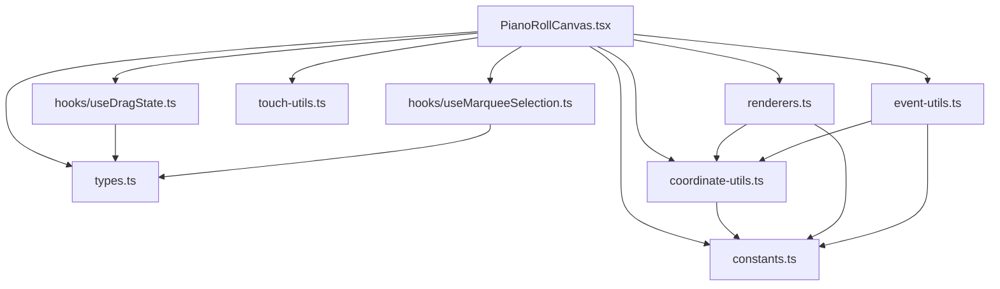

# Technical Design Document

## Overview

This document describes the technical design for refactoring the `PianoRollCanvas` component from a single ~3000-line file into a modular, well-organized folder structure. The refactoring preserves all existing functionality while improving code maintainability, readability, and testability.

### Goals

1. **Modularity**: Extract logical units into separate files with clear responsibilities
2. **Maintainability**: Make the codebase easier to navigate and modify
3. **Testability**: Enable unit testing of individual utility functions
4. **Backward Compatibility**: Maintain all existing public APIs and import paths

### Non-Goals

1. Feature additions or behavior changes
2. Performance optimizations (beyond natural improvements from better organization)
3. UI/UX modifications

## Architecture

### High-Level Structure

The refactored component will follow a flat folder structure within `components/PianoRoll/`:

```
components/
├── PianoRoll/
│   ├── index.ts              # Barrel export for public API
│   ├── PianoRollCanvas.tsx   # Main component (orchestration layer)
│   ├── constants.ts          # Configuration constants
│   ├── types.ts              # TypeScript interfaces
│   ├── coordinate-utils.ts   # Pixel ↔ beat/pitch conversion
│   ├── renderers.ts          # Canvas rendering functions
│   ├── event-utils.ts        # Event handling utilities
│   ├── touch-utils.ts        # Touch gesture utilities
│   └── hooks/
│       ├── useDragState.ts        # Note drag/resize state management
│       └── useMarqueeSelection.ts # Rectangle selection logic
├── PianoRollCanvas.tsx       # Backward-compat re-export alias
└── index.ts                  # Updated to re-export from PianoRoll/
```

### Complete Extraction Mapping

This table shows exactly what moves where from the original 2928-line `PianoRollCanvas.tsx`:

| Original Location | Lines | Destination File | Export Status |
|-------------------|-------|------------------|---------------|
| `CANVAS_CONFIG` | 14-89 | `constants.ts` | Public export |
| `DEFAULT_GRID_SNAP_CONFIG` | 92-95 | `constants.ts` | Internal |
| `RESIZE_HANDLE_WIDTH` | 241 | `constants.ts` | Internal |
| `DEFAULT_VISIBLE_REGION` | 353-358 | `constants.ts` | Internal |
| `SelectionModifiers` | 102-107 | `types.ts` | Public export |
| `PianoRollCanvasProps` | 112-237 | `types.ts` | Public export |
| `DragState` | 247-264 | `types.ts` | Internal |
| `ScrollbarDragState` | 268-279 | `types.ts` | Internal |
| `MarqueeState` | 283-296 | `types.ts` | Internal |
| `isOctaveBoundary()` | 303-305 | `coordinate-utils.ts` | Internal |
| `calculateScrollbarState()` | 318-348 | `coordinate-utils.ts` | Public export |
| `pixelXToBeat()` | 922-932 | `coordinate-utils.ts` | Internal |
| `pixelYToPitch()` | 940-953 | `coordinate-utils.ts` | Internal |
| `beatToPixelX()` | 960-973 | `coordinate-utils.ts` | Internal |
| `constrainVisibleRegion()` | 631-660 | `coordinate-utils.ts` | Internal |
| `isClickOnExistingNote()` | 889-897 | `event-utils.ts` | Internal |
| `findNoteAtPosition()` | 906-916 | `event-utils.ts` | Internal |
| `findNoteAtPixelPosition()` | 1155-1166 | `event-utils.ts` | Internal |
| `isOnResizeHandle()` | 979-986 | `event-utils.ts` | Internal |
| `getScrollbarAtPosition()` | 994-1047 | `event-utils.ts` | Internal |
| `getTouchDistance()` | 779-785 | `touch-utils.ts` | Internal |
| `getTouchCenter()` | 789-797 | `touch-utils.ts` | Internal |
| `setupCanvas()` | 2053-2078 | `renderers.ts` | Internal |
| `renderPitchLabels()` | 2097-2156 | `renderers.ts` | Internal |
| `renderTimeMarkers()` | 2164-2193 | `renderers.ts` | Internal |
| `renderGrid()` | 2199-2287 | `renderers.ts` | Internal |
| `calculateNotePosition()` | 2324-2363 | `renderers.ts` | Internal |
| `renderNotes()` | 2379-2455 | `renderers.ts` | Internal |
| `renderPlayhead()` | 2479-2513 | `renderers.ts` | Internal |
| `renderScrollbars()` | 2529-2623 | `renderers.ts` | Internal |
| `renderMarquee()` | 2639-2672 | `renderers.ts` | Internal |
| `dragState`, `scrollbarDragState` | - | `hooks/useDragState.ts` | Via hook |
| `handleScrollbarDrag()` | 1055-1134 | `hooks/useDragState.ts` | Via hook |
| `marqueeState` | - | `hooks/useMarqueeSelection.ts` | Via hook |
| `handleMarqueeMove()` | 1469-1548 | `hooks/useMarqueeSelection.ts` | Via hook |

### Module Dependency Flow



## Components and Interfaces

### 1. constants.ts

Exports canvas configuration constants used throughout the component.

**Exports:**
- `CANVAS_CONFIG` - Object containing all visual configuration (~60 properties)
- `DEFAULT_GRID_SNAP_CONFIG` - Default grid snap settings
- `DEFAULT_VISIBLE_REGION` - Initial visible region centered around middle C
- `RESIZE_HANDLE_WIDTH` - Width in pixels for resize handle detection zone

```typescript
// Example structure
export const CANVAS_CONFIG = {
  PITCH_LABEL_WIDTH: 50,
  TIME_MARKER_HEIGHT: 24,
  SCROLLBAR_WIDTH: 14,
  SCROLLBAR_HEIGHT: 14,
  // ... ~60 more properties for colors, dimensions, behavior
};

export const DEFAULT_GRID_SNAP_CONFIG: GridSnapConfig = {
  enabled: true,
  division: 0.25,
};

export const DEFAULT_VISIBLE_REGION: VisibleRegion = {
  startBeat: 0,
  endBeat: 16,
  startPitch: 48,
  endPitch: 72,
};

export const RESIZE_HANDLE_WIDTH = 8;
```

### 2. types.ts

Exports TypeScript interfaces for component props and internal state.

**Exports:**
- `PianoRollCanvasProps` - Main component props interface
- `SelectionModifiers` - Modifier key state for selection operations
- `DragState` - State tracking note drag/resize operations
- `ScrollbarDragState` - State tracking scrollbar drag operations
- `MarqueeState` - State tracking rectangle selection operations

```typescript
export interface SelectionModifiers {
  ctrlOrCmd: boolean;
  shift: boolean;
}

export interface PianoRollCanvasProps {
  notes?: Note[];
  selectedNoteIds?: Set<string>;
  visibleRegion?: VisibleRegion;
  playheadPosition?: number;
  // ... additional props
}

export interface DragState {
  note: Note;
  originalNote: Note;
  originalSelectedNotes: Map<string, Note>;
  startX: number;
  startY: number;
  mode: 'move' | 'resize';
  isGroupDrag: boolean;
}

export interface ScrollbarDragState {
  scrollbar: 'horizontal' | 'vertical';
  startPosition: number;
  initialScrollPosition: number;
  initialVisibleRegion: VisibleRegion;
}

export interface MarqueeState {
  startX: number;
  startY: number;
  currentX: number;
  currentY: number;
  previousSelection: Set<string>;
  isAdditive: boolean;
}
```

### 3. coordinate-utils.ts

Pure functions for coordinate conversion between pixel and musical coordinates.

**Exports:**
- `pixelXToBeat(pixelX, containerWidth, visibleRegion, config)` - Convert X pixel to beat
- `pixelYToPitch(pixelY, containerHeight, visibleRegion, config)` - Convert Y pixel to pitch
- `beatToPixelX(beat, containerWidth, visibleRegion, config)` - Convert beat to X pixel
- `pitchToPixelY(pitch, containerHeight, visibleRegion, config)` - Convert pitch to Y pixel (for completeness)
- `calculateScrollbarState(visibleRegion, totalBeats, totalPitchRange)` - Calculate scrollbar positions
- `isOctaveBoundary(midiNote)` - Check if MIDI note is C
- `constrainVisibleRegion(region)` - Clamp visible region to valid bounds (beats ≥ 0, pitches 0-127)

**Design Decision**: These functions will accept explicit parameters rather than using React refs, making them pure and easily testable.

```typescript
export function pixelXToBeat(
  pixelX: number,
  containerWidth: number,
  visibleRegion: VisibleRegion,
  config: { PITCH_LABEL_WIDTH: number; SCROLLBAR_WIDTH: number }
): number {
  const gridWidth = containerWidth - config.PITCH_LABEL_WIDTH - config.SCROLLBAR_WIDTH;
  const gridX = pixelX - config.PITCH_LABEL_WIDTH;
  const visibleBeats = visibleRegion.endBeat - visibleRegion.startBeat;
  return visibleRegion.startBeat + (gridX / gridWidth) * visibleBeats;
}

export function isOctaveBoundary(midiNote: number): boolean {
  return midiNote % 12 === 0;
}

export function calculateScrollbarState(
  visibleRegion: VisibleRegion,
  totalBeats: number,
  totalPitchRange: number
): ScrollbarState { /* ... */ }
```

### 4. renderers.ts

Canvas rendering functions for drawing visual elements.

**Exports:**
- `setupCanvas(canvas, container)` - Initialize canvas with device pixel ratio
- `renderGrid(ctx, dimensions, visibleRegion, activePitches, playingPitches, config)` - Draw grid
- `renderNotes(ctx, dimensions, notes, selectedIds, visibleRegion, isPlaying, playheadPosition, config)` - Draw notes
- `renderPlayhead(ctx, dimensions, playheadPosition, visibleRegion, config)` - Draw playhead line
- `renderPitchLabels(ctx, dimensions, visibleRegion, config)` - Draw pitch labels
- `renderTimeMarkers(ctx, dimensions, visibleRegion, config)` - Draw time markers
- `renderScrollbars(ctx, dimensions, visibleRegion, totalBeats, config)` - Draw scrollbars
- `renderMarquee(ctx, dimensions, marqueeState, config)` - Draw selection rectangle
- `calculateNotePosition(note, pixelsPerBeat, pixelsPerSemitone, gridX, gridY, gridHeight, visibleRegion)` - Calculate note rendering position

**Design Decision**: Renderers receive all required data as parameters rather than closures, enabling reuse and testing.

```typescript
export interface RenderDimensions {
  displayWidth: number;
  displayHeight: number;
  gridX: number;
  gridY: number;
  gridWidth: number;
  gridHeight: number;
}

export function setupCanvas(
  canvas: HTMLCanvasElement,
  container: HTMLDivElement
): { ctx: CanvasRenderingContext2D; displayWidth: number; displayHeight: number } | null { /* ... */ }

export function renderGrid(
  ctx: CanvasRenderingContext2D,
  dimensions: RenderDimensions,
  visibleRegion: VisibleRegion,
  activePitches: Set<number>,
  playingPitches: Set<number>,
  config: typeof CANVAS_CONFIG
): void { /* ... */ }
```

### 5. event-utils.ts

Utility functions for event handling and hit detection.

**Exports:**
- `findNoteAtPosition(notes, clickBeat, clickPitch)` - Find note at beat/pitch coordinates
- `findNoteAtPixelPosition(notes, pixelX, pixelY, converters)` - Find note at pixel coordinates with resize detection
- `isClickOnExistingNote(notes, clickBeat, clickPitch)` - Check if position overlaps a note
- `isOnResizeHandle(pixelX, note, beatToPixelX)` - Check if position is on resize handle
- `getScrollbarAtPosition(pixelX, pixelY, containerRect, visibleRegion, totalBeats, config)` - Detect scrollbar thumb hover

```typescript
export function findNoteAtPosition(
  notes: Note[],
  clickBeat: number,
  clickPitch: number
): Note | null {
  return notes.find(note => {
    const noteEndBeat = note.start + note.duration;
    return (
      note.pitch === clickPitch &&
      clickBeat >= note.start &&
      clickBeat < noteEndBeat
    );
  }) ?? null;
}

export function isOnResizeHandle(
  pixelX: number,
  note: Note,
  beatToPixelX: (beat: number) => number,
  resizeHandleWidth: number
): boolean {
  const noteEndBeat = note.start + note.duration;
  const noteEndPixelX = beatToPixelX(noteEndBeat);
  return pixelX >= noteEndPixelX - resizeHandleWidth && pixelX <= noteEndPixelX;
}
```

### 6. touch-utils.ts

Touch gesture utilities for mobile and trackpad interactions.

**Exports:**
- `getTouchDistance(touches)` - Calculate distance between two touch points
- `getTouchCenter(touches)` - Calculate center point between two touches

```typescript
export function getTouchDistance(touches: TouchList): number {
  if (touches.length < 2) return 0;
  const dx = touches[1].clientX - touches[0].clientX;
  const dy = touches[1].clientY - touches[0].clientY;
  return Math.sqrt(dx * dx + dy * dy);
}

export function getTouchCenter(touches: TouchList): { x: number; y: number } {
  if (touches.length < 2) {
    return { x: touches[0]?.clientX ?? 0, y: touches[0]?.clientY ?? 0 };
  }
  return {
    x: (touches[0].clientX + touches[1].clientX) / 2,
    y: (touches[0].clientY + touches[1].clientY) / 2,
  };
}
```

### 7. hooks/useDragState.ts

Custom hook encapsulating drag state management for note movement, resize, and scrollbar dragging.

**Exports:**
- `useDragState(options)` - Hook returning drag state and handlers

**Note**: This hook manages both note drag operations AND scrollbar drag operations. The original file has separate states (`dragState` and `scrollbarDragState`) which will be unified under this hook with a discriminated union type.

```typescript
interface UseDragStateOptions {
  notes: Note[];
  selectedNoteIds: Set<string>;
  visibleRegion: VisibleRegion;
  gridSnap: GridSnapConfig;
  containerRef: React.RefObject<HTMLDivElement>;
  effectiveTotalBeats: number;
  onNoteUpdate?: (note: Note) => void;
  onBulkNoteUpdate?: (updates: Map<string, Partial<Note>>) => void;
  onVisibleRegionChange?: (region: VisibleRegion) => void;
}

interface UseDragStateReturn {
  // Note drag state
  dragState: DragState | null;
  startNoteDrag: (note: Note, startX: number, startY: number, isResize: boolean, isGroupDrag: boolean) => void;
  updateNoteDrag: (currentX: number, currentY: number) => void;
  endNoteDrag: () => void;
  cancelNoteDrag: () => void;
  isNoteDragging: boolean;

  // Scrollbar drag state
  scrollbarDragState: ScrollbarDragState | null;
  startScrollbarDrag: (scrollbar: 'horizontal' | 'vertical', startPosition: number) => void;
  updateScrollbarDrag: (currentPosition: number) => void;
  endScrollbarDrag: () => void;
  isScrollbarDragging: boolean;

  // Combined flag
  isDragging: boolean;
}

export function useDragState(options: UseDragStateOptions): UseDragStateReturn {
  const [dragState, setDragState] = useState<DragState | null>(null);

  const cancelDrag = useCallback(() => {
    if (!dragState) return;
    // Restore original positions for all notes in group drag
    if (dragState.isGroupDrag && options.onBulkNoteUpdate) {
      const updates = new Map<string, Partial<Note>>();
      for (const [noteId, original] of dragState.originalSelectedNotes) {
        updates.set(noteId, { start: original.start, pitch: original.pitch });
      }
      options.onBulkNoteUpdate(updates);
    } else if (options.onNoteUpdate) {
      options.onNoteUpdate(dragState.originalNote);
    }
    setDragState(null);
  }, [dragState, options]);

  // ... additional handlers
  return { dragState, startDrag, updateDrag, endDrag, cancelDrag, isDragging: !!dragState };
}
```

### 8. hooks/useMarqueeSelection.ts

Custom hook encapsulating marquee (rectangle) selection logic.

**Exports:**
- `useMarqueeSelection(options)` - Hook returning marquee state and handlers

**Note**: This hook encapsulates the `handleMarqueeMove` logic from the original component, calculating intersecting notes during drag and updating selection state.

```typescript
interface UseMarqueeSelectionOptions {
  notes: Note[];
  selectedNoteIds: Set<string>;
  visibleRegion: VisibleRegion;
  containerRef: React.RefObject<HTMLDivElement>;
  onAddToSelection?: (noteIds: string[]) => void;
  onDeselectAll?: () => void;
}

interface UseMarqueeSelectionReturn {
  marqueeState: MarqueeState | null;
  startMarquee: (startX: number, startY: number, isAdditive: boolean) => void;
  updateMarquee: (currentX: number, currentY: number) => void;
  endMarquee: () => void;
  cancelMarquee: () => void;
  isSelecting: boolean;
}

export function useMarqueeSelection(options: UseMarqueeSelectionOptions): UseMarqueeSelectionReturn {
  const [marqueeState, setMarqueeState] = useState<MarqueeState | null>(null);

  const cancelMarquee = useCallback(() => {
    if (!marqueeState) return;
    // Restore previous selection
    options.onDeselectAll?.();
    if (marqueeState.previousSelection.size > 0) {
      options.onAddToSelection?.(Array.from(marqueeState.previousSelection));
    }
    setMarqueeState(null);
  }, [marqueeState, options]);

  // ... additional handlers
  return { marqueeState, startMarquee, updateMarquee, endMarquee, cancelMarquee, isSelecting: !!marqueeState };
}
```

### 9. PianoRollCanvas.tsx (Main Component)

The refactored main component serves as an orchestration layer that:
- Imports and composes modules from other files
- Manages React state and lifecycle
- Wires event handlers to the canvas
- Coordinates between hooks and rendering

**Target**: Under 500 lines of code

**What Stays in the Main Component:**
- All React refs (`canvasRef`, `containerRef`, `animationFrameRef`, `justFinishedDragRef`, `prevPlayheadPositionRef`, `lastTouchDistanceRef`, `lastTouchCenterRef`)
- Computed values (`effectiveTotalBeats`, `playingPitches` via useMemo)
- Internal state for hover detection (`isOverResizeHandle`, `isOverTimeline`, `isOverScrollbar`)
- Internal visible region state (`internalVisibleRegion`, `visibleRegion` selection)
- Event handler wiring functions that compose extracted utilities:
  - `handleWheel` - Scroll/zoom using coordinate utils
  - `handleTouchStart/Move/End` - Pinch-to-zoom using touch utils
  - `handleMouseDown` - Initiates drag or marquee via hooks
  - `handleCanvasMouseMove` - Updates hover state using event utils
  - `handleCanvasMouseLeave` - Clears hover state
  - `handleContextMenu` - Right-click deletion
  - `handleCanvasClick` - Note creation/selection using event utils
  - `handleDeleteNoteShortcut`, `handleTogglePlaybackShortcut` - Keyboard shortcut handlers
  - `updateVisibleRegion` - Controlled/uncontrolled pattern
- The `render` function that composes all rendering functions
- All `useEffect` hooks for event listener setup and cleanup
- The JSX return with canvas element

**External Dependencies** (unchanged, imported in main component):
- `snapPosition`, `getMinimumDuration` from `@/utils/grid-snap`
- `midiToNoteName`, `isBlackKey` from `@/lib/note-utils`
- `useKeyboardShortcuts` from `@/hooks`
- `isPlatformModifierKey`, `getNoteRange`, `getNotesInRect`, `calculateGroupMoveConstraints` from `@/lib/selection-utils`

```typescript
import { useRef, useEffect, useCallback, useState, useMemo } from 'react';
import { CANVAS_CONFIG, DEFAULT_GRID_SNAP_CONFIG, DEFAULT_VISIBLE_REGION, RESIZE_HANDLE_WIDTH } from './constants';
import type { PianoRollCanvasProps, DragState, ScrollbarDragState, MarqueeState } from './types';
import { pixelXToBeat, pixelYToPitch, beatToPixelX, calculateScrollbarState, isOctaveBoundary } from './coordinate-utils';
import { setupCanvas, renderGrid, renderNotes, renderPlayhead, renderPitchLabels, renderTimeMarkers, renderScrollbars, renderMarquee, calculateNotePosition } from './renderers';
import { findNoteAtPosition, findNoteAtPixelPosition, isClickOnExistingNote, isOnResizeHandle, getScrollbarAtPosition } from './event-utils';
import { getTouchDistance, getTouchCenter } from './touch-utils';
import { useDragState } from './hooks/useDragState';
import { useMarqueeSelection } from './hooks/useMarqueeSelection';

export function PianoRollCanvas(props: PianoRollCanvasProps) {
  // State and refs
  // Hook integrations
  // Event handler wiring
  // Effect setup
  // Render return
}

export default PianoRollCanvas;
```

### 10. index.ts (Barrel Export)

Public API re-exports for backward compatibility.

```typescript
// Main component
export { PianoRollCanvas, default } from './PianoRollCanvas';

// Constants (public API)
export { CANVAS_CONFIG } from './constants';

// Types (public API)
export type { PianoRollCanvasProps, SelectionModifiers } from './types';

// Utility functions (public API for testing)
export { calculateScrollbarState } from './coordinate-utils';
```

### 11. Backward Compatibility Alias

A re-export file at `components/PianoRollCanvas.tsx` maintains existing import paths.

```typescript
// components/PianoRollCanvas.tsx
// Backward compatibility alias - re-exports from new location
export { PianoRollCanvas, default, CANVAS_CONFIG } from './PianoRoll';
export type { PianoRollCanvasProps, SelectionModifiers } from './PianoRoll';
```

## Data Models

No new data models are introduced. The refactoring uses existing types from `@/types/`:

- `Note` - Musical note with id, pitch, start, duration, velocity
- `VisibleRegion` - Visible portion of the canvas (startBeat, endBeat, startPitch, endPitch)
- `GridSnapConfig` - Grid snap settings (enabled, division)
- `ScrollbarState` - Scrollbar positions and thumb sizes

## Correctness Properties

*A property is a characteristic or behavior that should hold true across all valid executions of a system—essentially, a formal statement about what the system should do. Properties serve as the bridge between human-readable specifications and machine-verifiable correctness guarantees.*

### Property 1: Coordinate Conversion Round-Trip

*For any* beat value within a visible region and any valid container dimensions, converting the beat to pixels and back to beats shall return a value within floating-point tolerance of the original beat.

More formally: `|pixelXToBeat(beatToPixelX(beat)) - beat| < ε` where ε is a small tolerance (e.g., 0.0001)

Similarly for the Y axis: `|pixelYToPitch(pitchToPixelY(pitch)) - pitch| < 1` (pitch rounds to nearest integer)

**Validates: Requirements 4.1, 4.2, 4.3, 4.6**

### Property 2: Scrollbar State Bounds Invariant

*For any* visible region with valid bounds (startBeat ≥ 0, 0 ≤ startPitch < endPitch ≤ 128), the calculated scrollbar state shall have:
- horizontalPosition in range [0, 1]
- verticalPosition in range [0, 1]
- horizontalThumbSize in range (0, 1]
- verticalThumbSize in range (0, 1]
- thumbSize shall be proportional to (visible range / total range)

**Validates: Requirements 4.4**

### Property 3: Octave Boundary Detection

*For any* MIDI note number in the valid range [0, 127], `isOctaveBoundary(note)` shall return `true` if and only if `note % 12 === 0` (the note is C).

**Validates: Requirements 4.5**

### Property 4: Note Hit Detection Consistency

*For any* list of notes and any beat/pitch position:
- `isClickOnExistingNote(notes, beat, pitch)` shall return `true` if and only if `findNoteAtPosition(notes, beat, pitch) !== null`
- If `findNoteAtPosition` returns a note, that note's bounds shall contain the query position: `note.start ≤ beat < note.start + note.duration` AND `note.pitch === Math.floor(pitch)`

**Validates: Requirements 6.1, 6.2, 6.3**

### Property 5: Resize Handle Detection

*For any* note and any pixel X position:
- `isOnResizeHandle(pixelX, note, beatToPixelX, RESIZE_HANDLE_WIDTH)` shall return `true` if and only if `pixelX` is within `RESIZE_HANDLE_WIDTH` pixels of the note's right edge
- More formally: `noteEndPixelX - RESIZE_HANDLE_WIDTH ≤ pixelX ≤ noteEndPixelX` where `noteEndPixelX = beatToPixelX(note.start + note.duration)`

**Validates: Requirements 6.4**

### Property 6: Scrollbar Hit Detection

*For any* pixel position (x, y) and valid canvas dimensions:
- `getScrollbarAtPosition` shall return `'horizontal'` if the position is within the horizontal scrollbar thumb bounds
- `getScrollbarAtPosition` shall return `'vertical'` if the position is within the vertical scrollbar thumb bounds
- `getScrollbarAtPosition` shall return `null` if the position is outside all scrollbar thumbs
- A position cannot be in both scrollbar thumbs simultaneously (they occupy distinct regions)

**Validates: Requirements 6.5**

### Property 7: Touch Geometry Calculations

*For any* two touch points with coordinates (x1, y1) and (x2, y2):
- `getTouchDistance(touches)` shall return `√((x2-x1)² + (y2-y1)²)` (Euclidean distance)
- `getTouchCenter(touches)` shall return `{ x: (x1+x2)/2, y: (y1+y2)/2 }` (midpoint)
- Distance shall always be non-negative
- Center shall always be within the bounding box of the two points

**Validates: Requirements 7.1, 7.2**

## Error Handling

### Module Loading Errors

If a module fails to load (e.g., due to circular dependency or syntax error), the error will be caught by React's error boundary and the component will display an error fallback.

### Canvas Context Errors

The `setupCanvas` function returns `null` if the canvas context cannot be obtained. The main component handles this gracefully by skipping rendering.

### Type Safety

TypeScript compilation ensures type correctness across module boundaries. If extracted types don't match their usage, the build will fail.

### Backward Compatibility Errors

If import paths change incorrectly, existing consumers will fail to compile, providing immediate feedback during development.

## Testing Strategy

### Dual Testing Approach

This refactoring benefits from both unit tests and property-based tests:

1. **Property-Based Tests (fast-check)**: Verify universal properties of pure utility functions
2. **Unit Tests (Vitest)**: Verify specific examples, edge cases, and integration points
3. **Integration Tests**: Verify the component works correctly after assembly

### Property-Based Testing Configuration

- **Library**: fast-check (already in devDependencies)
- **Iterations**: Minimum 100 per property test
- **Tag Format**: `Feature: piano-roll-refactor, Property {N}: {description}`

### Test File Structure

```
__tests__/
├── PianoRoll/
│   ├── coordinate-utils.test.ts    # Properties 1, 2, 3
│   ├── event-utils.test.ts         # Properties 4, 5, 6
│   ├── touch-utils.test.ts         # Property 7
│   ├── hooks/
│   │   ├── useDragState.test.ts    # Hook behavior examples
│   │   └── useMarqueeSelection.test.ts
│   └── PianoRollCanvas.test.tsx    # Integration tests
└── backward-compat.test.ts          # Import resolution smoke tests
```

### Property Test Examples

```typescript
// coordinate-utils.test.ts
import { describe, it, expect } from 'vitest';
import * as fc from 'fast-check';
import { pixelXToBeat, beatToPixelX, isOctaveBoundary, calculateScrollbarState } from '../coordinate-utils';
import { CANVAS_CONFIG } from '../constants';

describe('coordinate-utils', () => {
  // Feature: piano-roll-refactor, Property 1: Coordinate Conversion Round-Trip
  it('should round-trip beat -> pixel -> beat within tolerance', () => {
    fc.assert(
      fc.property(
        fc.float({ min: 0, max: 64 }),           // beat
        fc.float({ min: 400, max: 2000 }),       // containerWidth
        fc.float({ min: 0, max: 48 }),           // startBeat
        fc.float({ min: 16, max: 64 }),          // endBeat (must be > startBeat)
        (beat, containerWidth, startBeat, endBeat) => {
          if (endBeat <= startBeat) return true; // skip invalid regions
          if (beat < startBeat || beat > endBeat) return true; // skip out-of-range

          const visibleRegion = { startBeat, endBeat, startPitch: 48, endPitch: 72 };
          const config = { PITCH_LABEL_WIDTH: CANVAS_CONFIG.PITCH_LABEL_WIDTH, SCROLLBAR_WIDTH: CANVAS_CONFIG.SCROLLBAR_WIDTH };

          const pixel = beatToPixelX(beat, containerWidth, visibleRegion, config);
          const roundTrip = pixelXToBeat(pixel, containerWidth, visibleRegion, config);

          return Math.abs(roundTrip - beat) < 0.0001;
        }
      ),
      { numRuns: 100 }
    );
  });

  // Feature: piano-roll-refactor, Property 3: Octave Boundary Detection
  it('should detect octave boundaries correctly for all MIDI notes', () => {
    fc.assert(
      fc.property(
        fc.integer({ min: 0, max: 127 }),
        (midiNote) => {
          const result = isOctaveBoundary(midiNote);
          const expected = midiNote % 12 === 0;
          return result === expected;
        }
      ),
      { numRuns: 128 } // Test all MIDI notes
    );
  });
});
```

### Smoke Tests for Backward Compatibility

```typescript
// backward-compat.test.ts
import { describe, it, expect } from 'vitest';

describe('backward compatibility', () => {
  it('should import PianoRollCanvas from @/components/PianoRollCanvas', async () => {
    const module = await import('@/components/PianoRollCanvas');
    expect(module.PianoRollCanvas).toBeDefined();
    expect(module.CANVAS_CONFIG).toBeDefined();
  });

  it('should import from @/components barrel export', async () => {
    const module = await import('@/components');
    expect(module.PianoRollCanvas).toBeDefined();
    expect(module.CANVAS_CONFIG).toBeDefined();
  });

  it('should import types from @/components/PianoRoll', async () => {
    // TypeScript compilation verifies type imports
    const types = await import('@/components/PianoRoll');
    expect(types.CANVAS_CONFIG).toBeDefined();
  });
});
```

### Integration Tests

Integration tests verify the component functions correctly after assembly:
- Note creation via click
- Note drag and drop
- Note resize
- Marquee selection
- Scrollbar interaction
- Keyboard shortcuts

These tests use React Testing Library with `@testing-library/react` and should match existing test patterns in the project.

### Test Execution

```bash
# Run all tests
npm run test

# Run specific test file
npm run test -- coordinate-utils.test.ts

# Run with coverage
npm run test -- --coverage
```
