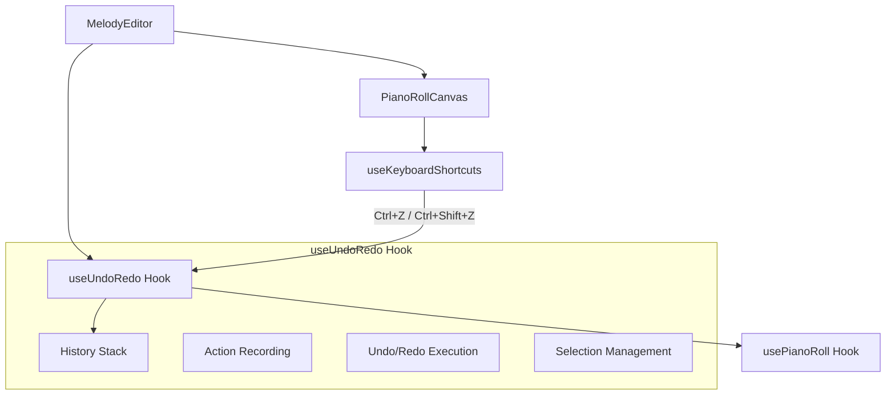
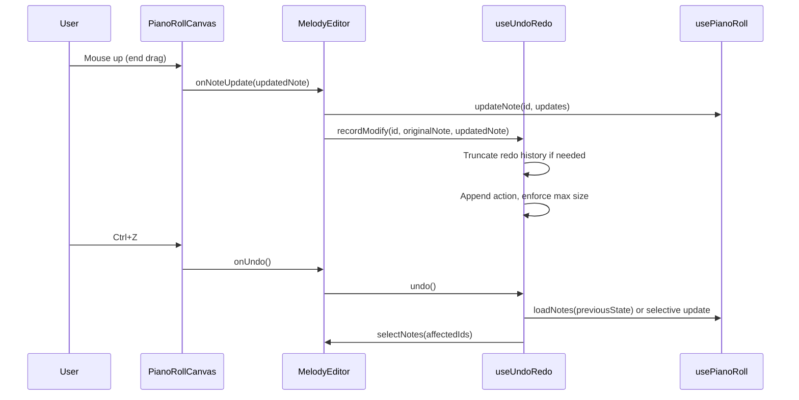

# Design Document: Piano Roll Undo/Redo

## Overview

This feature adds undo/redo functionality to the piano roll editor, allowing users to reverse and re-apply note mutations using standard keyboard shortcuts (Ctrl+Z / Ctrl+Shift+Z). The system records all note operations (create, delete, move, resize, velocity change, bulk operations) as discrete actions in a bounded history stack, supporting linear traversal with history branching on new edits after undo.

The design integrates with the existing `usePianoRoll` hook architecture by introducing a new `useUndoRedo` hook that wraps note mutation operations, captures before/after snapshots, and manages the history stack. The PianoRollCanvas keyboard shortcut system is extended to handle undo/redo key combinations.

## Architecture

The undo/redo system follows the **Command Pattern**, where each user operation is recorded as an action object containing enough information to both undo and redo the operation. The system is implemented as a custom React hook (`useUndoRedo`) that sits between the `MelodyEditor` component and the `usePianoRoll` hook.



**Key Design Decisions:**

1. **Hook-based architecture**: The undo/redo logic lives in a dedicated hook (`useUndoRedo`) rather than being embedded in `usePianoRoll`. This keeps concerns separated — `usePianoRoll` manages note state, `useUndoRedo` manages history.

2. **Snapshot-based actions**: Each action stores the complete before/after state of affected notes (not deltas). This avoids issues with accumulated floating-point errors from delta-based approaches and makes undo/redo a simple state replacement.

3. **Single-commit model**: Drag and resize operations only record an action on commit (mouse-up), not during intermediate moves. The `useDragState` hook already tracks `originalNote` and `originalSelectedNotes`, which provides the "before" state needed at commit time.

4. **Wrapper pattern**: `useUndoRedo` provides wrapped versions of mutation functions (`createNote`, `deleteNote`, `updateNote`, `bulkUpdateNotes`, etc.) that automatically record history. The `MelodyEditor` passes these wrapped functions to `PianoRollCanvas` instead of the raw `usePianoRoll` functions.

## Components and Interfaces

### UndoAction Type

```typescript
/**
 * Discriminated union representing all undoable actions.
 */
type ActionType = 'create' | 'delete' | 'modify' | 'batch';

interface CreateAction {
  type: 'create';
  note: Note; // The created note (for undo: remove it, for redo: re-add it)
}

interface DeleteAction {
  type: 'delete';
  note: Note; // The deleted note (for undo: restore it, for redo: remove it)
}

interface ModifyAction {
  type: 'modify';
  noteId: string;
  before: Note; // Full note state before the operation
  after: Note;  // Full note state after the operation
}

interface BatchAction {
  type: 'batch';
  operations: Array<CreateAction | DeleteAction | ModifyAction>;
}

type UndoAction = CreateAction | DeleteAction | ModifyAction | BatchAction;
```

### HistoryStack Interface

```typescript
interface HistoryStack {
  /** Array of recorded actions */
  actions: UndoAction[];
  /** Current position in the stack (0 = beginning, length = end) */
  pointer: number;
  /** Maximum number of undo entries */
  maxSize: number;
}
```

### useUndoRedo Hook

```typescript
interface UseUndoRedoOptions {
  /** Maximum history size (default: 100) */
  maxSize?: number;
  /** The current notes array from usePianoRoll */
  notes: Note[];
  /** The setNotes/loadNotes function from usePianoRoll */
  loadNotes: (notes: Note[]) => void;
  /** Selection management callbacks */
  selectNotes: (noteIds: string[]) => void;
  deselectAll: () => void;
}

interface UseUndoRedoReturn {
  /** Whether undo is available */
  canUndo: boolean;
  /** Whether redo is available */
  canRedo: boolean;
  /** Perform undo operation */
  undo: () => void;
  /** Perform redo operation */
  redo: () => void;
  /** Record a create action */
  recordCreate: (note: Note) => void;
  /** Record a delete action (single note) */
  recordDelete: (note: Note) => void;
  /** Record a modify action (move, resize, velocity) */
  recordModify: (noteId: string, before: Note, after: Note) => void;
  /** Record a batch action (group move, bulk velocity, cut) */
  recordBatch: (operations: Array<CreateAction | DeleteAction | ModifyAction>) => void;
  /** Clear all history (for loadNotes/MIDI import) */
  clearHistory: () => void;
  /** Whether a drag is in progress (suppresses recording) */
  setDragInProgress: (inProgress: boolean) => void;
}
```

### Integration with Existing Components

**MelodyEditor changes:**
- Instantiates `useUndoRedo` hook
- Wraps mutation handlers (`handleNoteCreate`, `handleNoteUpdate`, `handleNoteDelete`, `handleBulkNoteUpdate`) to call the appropriate `record*` functions
- Passes `undo`/`redo` callbacks to `PianoRollCanvas`
- Calls `clearHistory()` in the MIDI import path

**PianoRollCanvas changes:**
- Adds `onUndo?: () => void` and `onRedo?: () => void` props
- Passes these to `useKeyboardShortcuts`

**useKeyboardShortcuts changes:**
- Adds `onUndo?: () => void` and `onRedo?: () => void` props
- Handles `Ctrl+Z` / `Ctrl+Shift+Z` / `Ctrl+Y` key combinations
- Blocks undo/redo during drag operations (existing `isDragging` check)

## Data Models

### History Stack State

```typescript
// Internal state of the useUndoRedo hook
const [history, setHistory] = useState<UndoAction[]>([]);
const [pointer, setPointer] = useState<number>(0);

// pointer = 0: no undoable actions
// pointer = history.length: no redoable actions
// canUndo = pointer > 0
// canRedo = pointer < history.length
```

### Action Recording Flow



### Note State Capture Strategy

For **single note operations** (create, delete, move, resize, velocity):
- The "before" state is captured when the operation begins (e.g., `originalNote` in `DragState`)
- The "after" state is the note's state at commit time

For **batch operations** (group move, bulk velocity, cut):
- The "before" states are captured from `originalSelectedNotes` in `DragState`
- The "after" states are read from the current notes array at commit time

For **undo execution**, the strategy depends on the action type:
- `create` → Remove the note by ID from the notes array
- `delete` → Re-insert the note into the notes array
- `modify` → Replace the note with the `before` state
- `batch` → Apply the inverse of each sub-operation atomically

For **redo execution**, the inverse:
- `create` → Re-add the note
- `delete` → Remove the note by ID
- `modify` → Replace the note with the `after` state
- `batch` → Apply each sub-operation's forward direction

## Correctness Properties

*A property is a characteristic or behavior that should hold true across all valid executions of a system — essentially, a formal statement about what the system should do. Properties serve as the bridge between human-readable specifications and machine-verifiable correctness guarantees.*

### Property 1: Single-note mutation recording

*For any* single-note mutation (create, delete, move, resize, or velocity change) applied to any valid note, the History_Stack SHALL contain an action with the correct type and the exact before/after note states immediately after the operation commits.

**Validates: Requirements 1.1, 1.2, 1.3, 1.4, 1.6**

### Property 2: Batch mutation recording

*For any* batch operation (group move, cut, bulk velocity change) applied to any set of selected notes, the History_Stack SHALL contain exactly one Batch_Action with all affected notes' before and after states.

**Validates: Requirements 1.5, 1.7, 1.9**

### Property 3: No intermediate recording during drag

*For any* note drag or resize operation with N intermediate mouse-move events (N ≥ 0), the History_Stack length SHALL remain unchanged until the operation commits (mouse-up), at which point it SHALL increase by exactly one.

**Validates: Requirements 1.8**

### Property 4: Undo restores pre-action state

*For any* sequence of recorded actions, undoing the most recent action SHALL produce a notes array that is identical to the notes array that existed immediately before that action was originally applied.

**Validates: Requirements 2.1, 2.2, 2.3, 2.4, 2.5**

### Property 5: Redo re-applies post-action state

*For any* undone action, redoing it SHALL produce a notes array that is identical to the notes array that existed immediately after that action was originally applied.

**Validates: Requirements 3.1, 3.2, 3.3, 3.4, 3.5**

### Property 6: Undo-redo round trip

*For any* action, performing undo followed by redo SHALL produce a notes array identical to the state after the original action. Conversely, performing redo followed by undo (after an initial undo) SHALL produce a notes array identical to the state before the original action.

**Validates: Requirements 2.1, 2.2, 2.3, 2.4, 2.5, 3.1, 3.2, 3.3, 3.4, 3.5**

### Property 7: History branching discards redo

*For any* history state where K actions have been undone (K ≥ 1), recording a new action SHALL result in a history of length equal to (original_length - K + 1) with the pointer at the end, and all previously-undone actions SHALL be permanently discarded.

**Validates: Requirements 4.1, 4.2, 4.3**

### Property 8: History size limit

*For any* sequence of N recorded actions (N > 100), the History_Stack SHALL contain at most 100 undo entries, and the oldest actions beyond the limit SHALL not be recoverable via undo.

**Validates: Requirements 5.1, 5.2, 5.3**

### Property 9: Selection updated to affected notes after undo/redo

*For any* undo or redo operation that restores or modifies notes in the array, the selection SHALL contain exactly the IDs of all notes that were restored or modified by the operation.

**Validates: Requirements 7.1, 7.2, 7.5**

### Property 10: Selection cleared on note removal via undo/redo

*For any* undo of a create action or redo of a delete action (operations that remove notes from the array), the selection SHALL be empty after the operation completes.

**Validates: Requirements 7.3, 7.4**

### Property 11: LoadNotes clears all history

*For any* history state (with any number of undo/redo entries), calling loadNotes SHALL result in an empty History_Stack with zero entries and the pointer at position zero, making both undo and redo unavailable.

**Validates: Requirements 8.1, 8.3, 8.4**

### Property 12: Clear All records batch action

*For any* non-empty notes array, performing Clear All SHALL record a single Batch_Action in the History_Stack containing delete sub-actions for all notes that existed before the clear, and the Undo_Pointer SHALL remain available for undo.

**Validates: Requirements 8.2**

## Error Handling

| Scenario | Handling Strategy |
|----------|------------------|
| Undo when history is empty | No-op. `canUndo` returns false, `undo()` exits early. |
| Redo when no redoable actions | No-op. `canRedo` returns false, `redo()` exits early. |
| Undo/redo for note ID that no longer exists | Skip that note's restoration gracefully. Log a warning in development. |
| History corruption (pointer out of bounds) | Clamp pointer to valid range [0, history.length]. Reset if unrecoverable. |
| Action recorded during drag (race condition) | `setDragInProgress(true)` suppresses recording. Actions are only recorded on commit. |
| Memory pressure from large history | The 100-action cap bounds memory. Each action stores only affected notes, not the full array. |
| Rapid undo/redo (multiple keystrokes) | Each call is synchronous within React's state update. Multiple rapid calls queue correctly via React's batching. |

## Testing Strategy

### Unit Tests (Example-Based)

- Keyboard shortcut integration (Ctrl+Z triggers undo, Ctrl+Shift+Z triggers redo)
- Shortcuts blocked during drag operations
- Shortcuts blocked when canvas doesn't have focus
- Shortcuts blocked when typing in text input fields
- preventDefault called on handled shortcuts
- Edge cases: undo on empty history, redo at end of history
- Atomicity: new action after undo correctly discards redo and records new action before next undo can fire

### Property-Based Tests

Property-based testing is appropriate for this feature because the undo/redo logic involves:
- Pure functions (history stack manipulation)
- Universal properties that hold across wide input ranges (any note data, any sequence of operations)
- Large input space (arbitrary notes, arbitrary sequences of create/delete/move/resize/velocity operations)

**Library:** `fast-check` (already in devDependencies)
**Minimum iterations:** 100 per property
**Tag format:** `Feature: piano-roll-undo-redo, Property {N}: {title}`

Each correctness property (1-12) will be implemented as a dedicated property-based test, generating:
- Random valid notes (pitch 0-127, start 0-10000, duration 0.001-1000, velocity 0-1)
- Random operation sequences (create, delete, modify, batch)
- Random undo/redo depths
- Random history states (empty, partial, full at 100 cap)

### Integration Tests

- End-to-end flow: create notes → undo → redo → verify canvas renders correctly
- MIDI import clears history (loadNotes integration)
- Clear All records batch action and is undoable
- Velocity lane operations are recorded and undoable
- Group move from PianoRollCanvas commits batch action correctly
