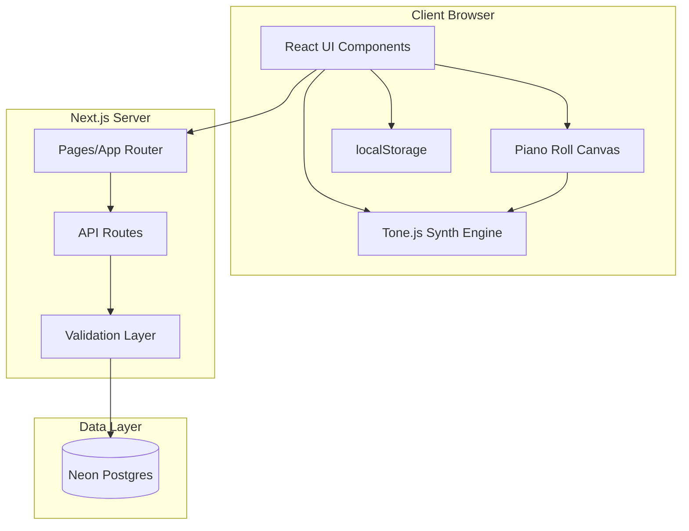
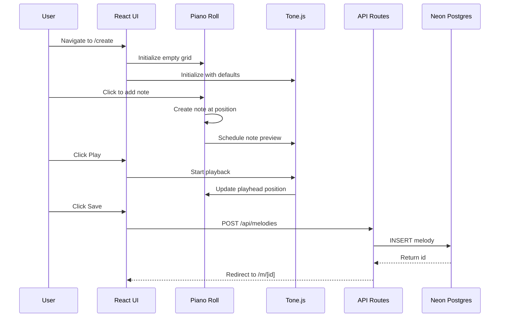

# Technical Design Document

## Overview

Tone Sketch is a web-based music creation platform built as a full-stack Next.js application. The system enables users to sketch melodies using a piano roll editor, preview them through a Tone.js-powered synthesizer, and share compositions publicly. The architecture prioritizes real-time audio-visual synchronization, responsive UI interactions at 60fps, and reliable data persistence through PostgreSQL.

### Key Design Goals

1. **Low-latency audio**: Sub-50ms playback response using Tone.js Web Audio scheduling
2. **Smooth interactions**: 60fps rendering during drag operations and playback
3. **Simple ownership model**: localStorage-based owner_id without user authentication
4. **Atomic persistence**: Database transactions ensure melody data integrity

### Technology Stack

- **Frontend**: Next.js 16 (App Router) with React 19, TypeScript
- **Audio Engine**: Tone.js for Web Audio synthesis
- **Canvas Rendering**: HTML5 Canvas for piano roll grid (performance-critical)
- **Database**: Neon Postgres (via Vercel Marketplace, free tier available) with JSONB for flexible note/synth storage
- **Database Client**: `@neondatabase/serverless` for serverless-optimized PostgreSQL queries
- **Styling**: Tailwind CSS for UI components
- **Deployment**: Vercel (serverless functions for API routes)

## Architecture

The application follows a layered architecture separating UI, business logic, audio engine, and data persistence concerns.



### System Flow



## Components and Interfaces

### Core Components

#### 1. PianoRollEditor

The primary visual editing interface rendered using HTML5 Canvas for performance.

```typescript
interface PianoRollEditorProps {
  notes: Note[];
  playheadPosition: number;
  isPlaying: boolean;
  gridSnap: GridSnapConfig;
  visibleRegion: VisibleRegion;
  readOnly: boolean;
  onNoteCreate: (note: Note) => void;
  onNoteUpdate: (noteId: string, updates: Partial<Note>) => void;
  onNoteDelete: (noteId: string) => void;
  onPlayheadChange: (position: number) => void;
  onVisibleRegionChange: (region: VisibleRegion) => void;
}

interface GridSnapConfig {
  enabled: boolean;
  division: GridDivision;
}

type GridDivision = 1 | 0.5 | 0.25 | 0.125 | 0.0625; // 1, 1/2, 1/4, 1/8, 1/16 beats

interface VisibleRegion {
  startBeat: number;
  endBeat: number;
  startPitch: number; // MIDI note number
  endPitch: number;
}
```

**Rendering Strategy**:
- Use `requestAnimationFrame` for smooth 60fps updates
- Batch note rendering by visible region
- Separate layers for grid, notes, and playhead
- Debounce scroll events to prevent excessive redraws

#### 2. SynthesizerEngine

Wraps Tone.js to provide melody playback with configurable sound parameters.

```typescript
interface SynthesizerConfig {
  oscillatorType: OscillatorType;
  volume: number; // 0-1
  envelope: ADSREnvelope;
  filter: FilterConfig;
}

type OscillatorType = 'sine' | 'square' | 'sawtooth' | 'triangle';

interface ADSREnvelope {
  attack: number;  // 0-2 seconds
  decay: number;   // 0-2 seconds
  sustain: number; // 0-1 level
  release: number; // 0-5 seconds
}

interface FilterConfig {
  enabled: boolean;
  type: 'lowpass' | 'highpass';
  frequency: number; // 20-20000 Hz
}

interface SynthesizerEngine {
  configure(config: Partial<SynthesizerConfig>): void;
  play(notes: Note[], startPosition: number, loop: boolean): void;
  pause(): void;
  stop(): void;
  setPlayheadPosition(position: number): void;
  onPlayheadUpdate: (callback: (position: number) => void) => void;
  triggerNote(note: Note): void;
  dispose(): void;
}
```

**Implementation Notes**:
- Use Tone.js `PolySynth` for polyphonic playback
- Schedule notes using Tone.js Transport for precise timing
- Apply filter via Tone.js `Filter` node in audio chain
- Use `Tone.Draw` to synchronize visual updates with audio

#### 3. SynthControls

UI component for adjusting synthesizer parameters.

```typescript
interface SynthControlsProps {
  config: SynthesizerConfig;
  onChange: (config: Partial<SynthesizerConfig>) => void;
  disabled: boolean;
}
```

#### 4. TransportControls

Playback control buttons (play, pause, stop, loop toggle).

```typescript
interface TransportControlsProps {
  isPlaying: boolean;
  isPaused: boolean;
  isLooping: boolean;
  onPlay: () => void;
  onPause: () => void;
  onStop: () => void;
  onLoopToggle: () => void;
}
```

#### 5. GridSnapControls

Toggle and division selector for grid snapping.

```typescript
interface GridSnapControlsProps {
  config: GridSnapConfig;
  onChange: (config: GridSnapConfig) => void;
}
```

#### 6. MelodyFeed

Homepage feed displaying paginated melody list with preview capabilities.

```typescript
interface MelodyFeedProps {
  initialMelodies: MelodySummary[];
}

interface MelodySummary {
  id: string;
  title: string;
  createdAt: string;
}
```

#### 7. MelodyCard

Individual feed item with play preview and navigation.

```typescript
interface MelodyCardProps {
  melody: MelodySummary;
  isPlaying: boolean;
  isLoading: boolean;
  onPlayClick: () => void;
  onStopClick: () => void;
}
```

### API Routes

#### GET /api/melodies

Fetch paginated melody list for feed.

```typescript
// Query Parameters
interface GetMelodiesQuery {
  page?: number;  // Default: 1
  limit?: number; // Default: 20, Max: 100
}

// Response
interface GetMelodiesResponse {
  melodies: MelodySummary[];
  total: number;
  page: number;
  limit: number;
  hasMore: boolean;
}
```

#### GET /api/melodies/[id]

Fetch single melody with full data.

```typescript
// Response
interface GetMelodyResponse {
  id: string;
  title: string;
  notes: Note[];
  tempo: number;
  synth: SynthesizerConfig;
  createdAt: string;
  ownerId: string;
}
```

#### POST /api/melodies

Create new melody.

```typescript
// Request Body
interface CreateMelodyRequest {
  title: string;
  notes: Note[];
  tempo: number;
  synth: SynthesizerConfig;
  ownerId: string;
}

// Response
interface CreateMelodyResponse {
  id: string;
}
```

#### PUT /api/melodies/[id]

Update existing melody.

```typescript
// Request Body
interface UpdateMelodyRequest {
  title: string;
  notes: Note[];
  tempo: number;
  synth: SynthesizerConfig;
  ownerId: string;
}

// Response: 200 OK with empty body on success
```

#### DELETE /api/melodies/[id]

Delete melody.

```typescript
// Request Body
interface DeleteMelodyRequest {
  ownerId: string;
}

// Response: 204 No Content on success
```

### MIDI Processing

#### MidiImporter

Parses MIDI files and converts to internal Note format.

```typescript
interface MidiImporter {
  parse(file: File): Promise<MidiImportResult>;
}

interface MidiImportResult {
  notes: Note[];
  tempo: number;
}

// Supported formats: SMF Type 0 and Type 1
// Max file size: 5MB
// Behavior: Merges all tracks, extracts first tempo event
```

#### MidiExporter

Generates MIDI files from melody data.

```typescript
interface MidiExporter {
  export(melody: ExportableMelody): Blob;
}

interface ExportableMelody {
  title: string;
  notes: Note[];
  tempo: number;
}

// Output format: SMF Type 0
// Includes tempo track and note track
```

## Data Models

### Note

Core data structure for musical events.

```typescript
interface Note {
  id: string;           // UUID v4, client-generated
  pitch: number;        // MIDI note 0-127
  start: number;        // Start time in beats (>= 0, <= 10000)
  duration: number;     // Duration in beats (>= 0.001, <= 1000)
  velocity: number;     // Volume 0-1
}
```

### Melody

Complete composition with metadata.

```typescript
interface Melody {
  id: string;           // UUID v4
  title: string;        // 1-200 characters
  notes: Note[];        // Max 10000 notes
  tempo: number;        // BPM (integer)
  synth: SynthesizerConfig;
  createdAt: Date;
  ownerId: string;      // UUID v4
}
```

### Database Schema

Neon Postgres uses standard PostgreSQL syntax. The database is provisioned via the Vercel Marketplace integration.

```sql
-- Run via Neon console or migration script
CREATE TABLE melodies (
  id TEXT PRIMARY KEY NOT NULL,
  title TEXT NOT NULL CHECK (char_length(title) <= 200),
  notes JSONB NOT NULL,
  tempo INT NOT NULL,
  synth JSONB NOT NULL,
  created_at TIMESTAMP NOT NULL DEFAULT NOW(),
  owner_id TEXT NOT NULL
);

CREATE INDEX idx_melodies_created_at ON melodies(created_at DESC);
CREATE INDEX idx_melodies_owner_id ON melodies(owner_id);
```

**Neon Connection (Serverless):**
```typescript
import { neon } from '@neondatabase/serverless';

const sql = neon(process.env.DATABASE_URL!);

// Example query
const result = await sql`
  SELECT * FROM melodies WHERE id = ${id}
`;
```

### Validation Constraints

| Field | Type | Constraints |
|-------|------|-------------|
| Note.pitch | integer | 0 ≤ value ≤ 127 |
| Note.start | number | 0 ≤ value ≤ 10000 |
| Note.duration | number | 0.001 ≤ value ≤ 1000 |
| Note.velocity | number | 0 ≤ value ≤ 1 |
| Melody.title | string | 1 ≤ length ≤ 200 |
| Melody.notes | array | length ≤ 10000 |
| Synth.volume | number | 0 ≤ value ≤ 1 |
| Synth.envelope.attack | number | 0 ≤ value ≤ 2 |
| Synth.envelope.decay | number | 0 ≤ value ≤ 2 |
| Synth.envelope.sustain | number | 0 ≤ value ≤ 1 |
| Synth.envelope.release | number | 0 ≤ value ≤ 5 |
| Synth.filter.frequency | number | 20 ≤ value ≤ 20000 |


## Correctness Properties

*A property is a characteristic or behavior that should hold true across all valid executions of a system—essentially, a formal statement about what the system should do. Properties serve as the bridge between human-readable specifications and machine-verifiable correctness guarantees.*

### Property 1: Note Rendering Position Calculation

*For any* Note with valid pitch (0-127), start time (≥0), and duration (>0), the rendered rectangle position SHALL be calculated as:
- X position = start time × pixels per beat
- Y position = (127 - pitch) × pixels per semitone
- Width = duration × pixels per beat

**Validates: Requirements 1.2**

### Property 2: Note Creation at Valid Position

*For any* click on the piano roll grid at a position not occupied by an existing note, a new Note SHALL be created with:
- pitch = MIDI note corresponding to Y position
- start = beat corresponding to X position (quantized if snap enabled)
- duration = 1 beat (default)
- velocity = 0.8 (default)

**Validates: Requirements 2.1, 2.2**

### Property 3: Grid Snap Quantization

*For any* position value P and grid division D (where D ∈ {1, 0.5, 0.25, 0.125, 0.0625}), when grid snap is enabled, the snapped position SHALL equal `round(P / D) * D`.

**Validates: Requirements 2.3, 3.2, 5.2, 7.4**

### Property 4: Note Boundary Clamping

*For any* drag operation on a Note:
- The start time SHALL be clamped to the range [0, ∞)
- The pitch SHALL be clamped to the range [0, 127]

**Validates: Requirements 3.3, 4.2**

### Property 5: Minimum Duration Enforcement

*For any* resize operation on a Note:
- When grid snap is enabled, the minimum duration SHALL be the current grid division
- When grid snap is disabled, the minimum duration SHALL be 0.1 beats

**Validates: Requirements 5.3, 5.4**

### Property 6: Drag Cancel Restores Original State

*For any* Note with initial position (pitch, start, duration) and any drag operation that is cancelled, the Note SHALL be restored to its exact original position values.

**Validates: Requirements 3.5**

### Property 7: Note Deletion Removes from Melody

*For any* Note in a Melody, when the Note is deleted (via Delete/Backspace key or right-click), the Note SHALL no longer exist in the Melody's notes array.

**Validates: Requirements 6.1, 6.2**

### Property 8: Free Positioning Resolution

*For any* note position when grid snap is disabled, the position SHALL be quantized to 1/32 beat resolution (0.03125 beats).

**Validates: Requirements 7.5**

### Property 9: Timeline Click Positions Playhead

*For any* click on the timeline area at time T, the playhead position SHALL be set to T.

**Validates: Requirements 8.5**

### Property 10: MIDI Import/Export Round-Trip

*For any* valid set of Notes with pitch (0-127), start (≥0), duration (>0), and velocity (0-1), exporting to MIDI and re-importing SHALL produce a set of Notes with identical pitch, start time, and duration values for each Note.

**Validates: Requirements 16.7, 17.1, 17.2, 17.4**

### Property 11: Melody Persistence Round-Trip

*For any* valid Melody (title 1-200 chars, notes ≤10000, valid synth config), saving to the database and retrieving SHALL produce an identical Melody with:
- Same title
- Same notes array (all properties preserved)
- Same tempo
- Same synthesizer configuration (oscillator, volume, ADSR, filter)

**Validates: Requirements 9.4, 10.4, 11.6, 12.5, 18.3, 20.6**

### Property 12: Title Validation

*For any* string S:
- If S is empty or length > 200 characters, save SHALL be rejected with a validation error
- If 1 ≤ length(S) ≤ 200, the title SHALL be accepted

**Validates: Requirements 18.6, 27.2**

### Property 13: Note Count Limit

*For any* Melody with notes array length N:
- If N > 10000, save SHALL be rejected with a validation error
- If N ≤ 10000, the notes array SHALL be accepted

**Validates: Requirements 27.3**

### Property 14: Note Field Validation

*For any* Note object, the following validations SHALL apply:
- pitch: integer, 0 ≤ pitch ≤ 127
- start: number, 0 ≤ start ≤ 10000
- duration: number, 0.001 ≤ duration ≤ 1000
- velocity: number, 0 ≤ velocity ≤ 1

If any field fails validation, the save request SHALL be rejected with an error indicating the invalid field and reason.

**Validates: Requirements 31.1, 31.2, 31.3, 31.4, 31.5**

### Property 15: Owner Authorization

*For any* update or delete request on a Melody with owner_id O:
- If request owner_id ≠ O, the request SHALL be rejected with 403 Forbidden
- If request lacks owner_id, the request SHALL be rejected with 403 Forbidden
- If request owner_id = O, the request SHALL be processed

**Validates: Requirements 20.7, 21.7, 26.3, 26.4, 26.5**

### Property 16: API Error Response Format

*For any* API error response, the response body SHALL be a JSON object containing an "error" field with a human-readable message. Additionally:
- 400 responses SHALL include a "details" field listing invalid fields
- 404 responses SHALL indicate the resource type and identifier not found
- 500 responses SHALL NOT expose internal system details

**Validates: Requirements 28.1, 28.2, 28.3, 28.4**

### Property 17: Feed Sorting

*For any* set of melodies returned by the feed API, the melodies SHALL be ordered by created_at descending (newest first).

**Validates: Requirements 22.1**

### Property 18: Title Truncation in Feed

*For any* melody title displayed in the feed:
- If length > 100 characters, display SHALL show first 100 characters followed by ellipsis ("...")
- If length ≤ 100 characters, display SHALL show the complete title

**Validates: Requirements 22.2**

### Property 19: Export Filename Sanitization

*For any* melody title, the exported MIDI filename SHALL:
- Replace all characters not valid in filenames with underscores
- End with the ".mid" extension

**Validates: Requirements 17.3**

### Property 20: UUID Generation

*For any* newly created Melody, the assigned id SHALL be a valid UUID v4 format string.

**Validates: Requirements 27.4**

## Error Handling

### Client-Side Errors

| Error Type | Handling Strategy | User Feedback |
|------------|-------------------|---------------|
| MIDI parse failure | Catch parser exception | "Could not parse MIDI file. Please ensure it's a valid .mid file." |
| MIDI file too large | Check size before parsing | "File exceeds 5MB limit. Please use a smaller file." |
| Audio context unavailable | Detect on initialization | "Audio playback unavailable. Please check browser permissions." |
| Network request timeout | 10s timeout, offer retry | "Request timed out. Please check your connection and try again." |
| Validation error | Display field-specific messages | "Title must be between 1 and 200 characters." |

### Server-Side Errors

| Status Code | Condition | Response Format |
|-------------|-----------|-----------------|
| 400 Bad Request | Validation failure | `{ "error": "Validation failed", "details": [{"field": "...", "reason": "..."}] }` |
| 401 Unauthorized | Missing owner_id | `{ "error": "Authentication required" }` |
| 403 Forbidden | owner_id mismatch | `{ "error": "You do not have permission to perform this action" }` |
| 404 Not Found | Resource doesn't exist | `{ "error": "Melody not found", "id": "..." }` |
| 500 Internal Error | Unexpected server error | `{ "error": "An unexpected error occurred" }` |

### Database Error Recovery

- All write operations use transactions
- On failure, transaction is rolled back
- Client receives error response with generic message
- Server logs detailed error for debugging

### Audio Error Handling

- Detect AudioContext state on initialization
- Handle "suspended" state by requesting user interaction
- Catch synthesis errors and stop affected notes
- Display user-friendly error messages for audio failures

## Testing Strategy

### Unit Testing

Unit tests cover specific behaviors, edge cases, and component isolation.

**Piano Roll Editor Tests**:
- Note rendering at correct positions
- Click detection and note selection
- Drag operation state management
- Grid snap calculation accuracy
- Scroll and zoom behavior

**Synthesizer Engine Tests**:
- Configuration application
- Note scheduling
- Playback state transitions
- ADSR envelope application

**MIDI Processing Tests**:
- Type 0 file parsing
- Type 1 file parsing (multi-track merge)
- Tempo extraction
- Note conversion accuracy
- Export file format compliance
- Edge cases: empty files, large files, corrupted files

**API Route Tests**:
- Request validation
- Response format compliance
- Authorization checks
- Database transaction behavior
- Error response formatting

### Property-Based Testing

Property tests use randomized inputs to verify universal properties hold across all valid inputs.

**Configuration**: Each property test runs minimum 100 iterations using fast-check library.

**Tagging Format**: Each test includes comment referencing design property:
```typescript
// Feature: tone-sketch, Property 10: MIDI Import/Export Round-Trip
```

**Property Test Coverage**:

| Property | Test Description | Generator |
|----------|------------------|-----------|
| 3 | Grid snap quantization | Random positions × all divisions |
| 10 | MIDI round-trip | Random valid Note arrays |
| 11 | Melody persistence round-trip | Random valid Melody objects |
| 12 | Title validation | Arbitrary strings including edge lengths |
| 14 | Note field validation | Random numbers for each field |
| 15 | Owner authorization | Random owner_ids with match/mismatch |
| 17 | Feed sorting | Random melody sets with timestamps |
| 18 | Title truncation | Strings of varying lengths |
| 19 | Filename sanitization | Strings with special characters |
| 20 | UUID generation | Batch UUID creation |

### Integration Testing

**API Integration Tests**:
- Full CRUD lifecycle for melodies
- Pagination behavior verification
- Concurrent request handling
- Database constraint enforcement

**UI Integration Tests (Playwright)**:
- Create page workflow: create notes → save → redirect
- Edit page workflow: load → edit → save
- Feed interaction: scroll → preview → navigate
- MIDI import/export workflow

### Performance Testing

**Frame Rate Validation**:
- Measure fps during drag operations
- Measure fps during playback with moving playhead
- Target: 55fps minimum, 60fps average

**Latency Validation**:
- Measure audio onset latency
- Measure UI response to user input
- Target: <50ms for audio, <100ms for UI

### Test Organization

```
tests/
├── unit/
│   ├── piano-roll/
│   │   ├── note-rendering.test.ts
│   │   ├── grid-snap.test.ts
│   │   └── drag-operations.test.ts
│   ├── synthesizer/
│   │   ├── configuration.test.ts
│   │   └── playback.test.ts
│   ├── midi/
│   │   ├── importer.test.ts
│   │   └── exporter.test.ts
│   └── api/
│       ├── melodies.test.ts
│       └── validation.test.ts
├── property/
│   ├── grid-snap.property.test.ts
│   ├── midi-roundtrip.property.test.ts
│   ├── melody-persistence.property.test.ts
│   ├── validation.property.test.ts
│   └── authorization.property.test.ts
├── integration/
│   ├── api/
│   │   └── melody-lifecycle.test.ts
│   └── e2e/
│       ├── create-workflow.spec.ts
│       ├── edit-workflow.spec.ts
│       └── feed-interaction.spec.ts
└── performance/
    ├── frame-rate.test.ts
    └── latency.test.ts
```
