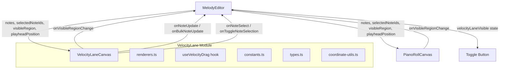

# Design Document: Velocity Lane Editor

## Overview

The Velocity Lane Editor adds an FL Studio-style collapsible panel below the piano roll canvas that visualizes and enables editing of note velocities. It follows the same canvas-based rendering approach as the existing PianoRoll component, shares the horizontal time axis, and integrates into the MelodyEditor's existing prop-driven state management pattern.

The design prioritizes:
- **Shared state via props** — the parent MelodyEditor owns notes, selection, visible region, and playhead; both PianoRollCanvas and VelocityLaneCanvas receive these as props.
- **Consistent rendering patterns** — HTML5 Canvas with devicePixelRatio handling, extracted renderer functions, and requestAnimationFrame scheduling.
- **Modular architecture** — a dedicated `components/VelocityLane/` directory mirroring the PianoRoll structure (canvas component, renderers, constants, types, hooks, index barrel).

## Architecture



### Data Flow

1. **MelodyEditor** holds all shared state: `notes`, `selectedNoteIds`, `visibleRegion`, `playheadPosition`, and the new `velocityLaneVisible` boolean.
2. Both **PianoRollCanvas** and **VelocityLaneCanvas** receive the same `visibleRegion` and `notes` props — this guarantees horizontal synchronization with zero additional logic.
3. Scroll events in either component call `onVisibleRegionChange` on the parent, which updates state and triggers re-render of both.
4. Velocity edits in the VelocityLane call `onNoteUpdate` (single) or `onBulkNoteUpdate` (multi-note), reusing the same callbacks the PianoRoll already uses.
5. Selection changes in the VelocityLane use the same `onNoteSelect` / `onToggleNoteSelection` callbacks — shared selection source of truth.

### Layout Strategy

When the velocity lane is visible, the MelodyEditor splits the main content area vertically:
- **PianoRollCanvas**: ~75% of available height
- **VelocityLaneCanvas**: ~25% of available height

This is achieved with CSS flex layout (`flex-[3]` and `flex-1`) rather than fixed pixel values, making the split responsive.

## Components and Interfaces

### VelocityLaneCanvas (Main Component)

```typescript
// components/VelocityLane/VelocityLaneCanvas.tsx

export interface VelocityLaneCanvasProps {
  /** Notes to render velocity bars for */
  notes: Note[];
  /** IDs of currently selected notes */
  selectedNoteIds: Set<string>;
  /** Current visible region (shared with PianoRoll) */
  visibleRegion: VisibleRegion;
  /** Current playhead position in beats */
  playheadPosition?: number;
  /** Callback when a note's velocity is updated */
  onNoteUpdate?: (note: Note) => void;
  /** Callback for batch velocity updates (multi-note) */
  onBulkNoteUpdate?: (updates: Map<string, Partial<Note>>) => void;
  /** Callback when visible region changes (horizontal scroll) */
  onVisibleRegionChange?: (region: VisibleRegion) => void;
  /** Callback to select a single note (replaces selection) */
  onNoteSelect?: (noteId: string) => void;
  /** Callback to toggle a note in the selection */
  onToggleNoteSelection?: (noteId: string) => void;
  /** Callback to deselect all */
  onDeselectAll?: () => void;
  /** Additional CSS class names */
  className?: string;
}
```

### useVelocityDrag Hook

```typescript
// components/VelocityLane/hooks/useVelocityDrag.ts

export interface UseVelocityDragOptions {
  notes: Note[];
  selectedNoteIds: Set<string>;
  containerRef: React.RefObject<HTMLDivElement | null>;
  onNoteUpdate?: (note: Note) => void;
  onBulkNoteUpdate?: (updates: Map<string, Partial<Note>>) => void;
}

export interface VelocityDragState {
  /** The note whose bar is being dragged */
  noteId: string;
  /** Original velocity of the dragged note at drag start */
  originalVelocity: number;
  /** Original velocities of all affected notes (for multi-note) */
  originalVelocities: Map<string, number>;
  /** Whether this is a multi-note drag */
  isMultiNote: boolean;
}

export interface UseVelocityDragReturn {
  dragState: VelocityDragState | null;
  startDrag: (noteId: string, pointerY: number) => void;
  updateDrag: (pointerY: number) => void;
  endDrag: () => void;
  cancelDrag: () => void;
}
```

### Renderer Functions

```typescript
// components/VelocityLane/renderers.ts

export function setupCanvas(
  canvas: HTMLCanvasElement | null,
  container: HTMLDivElement | null
): { ctx: CanvasRenderingContext2D; displayWidth: number; displayHeight: number; dpr: number } | null;

export function renderVelocityBars(
  ctx: CanvasRenderingContext2D,
  dimensions: VelocityRenderDimensions,
  notes: Note[],
  selectedNoteIds: Set<string>,
  visibleRegion: VisibleRegion,
  dragState: VelocityDragState | null
): void;

export function renderBaseline(
  ctx: CanvasRenderingContext2D,
  dimensions: VelocityRenderDimensions
): void;

export function renderScaleIndicator(
  ctx: CanvasRenderingContext2D,
  dimensions: VelocityRenderDimensions
): void;

export function renderBeatGrid(
  ctx: CanvasRenderingContext2D,
  dimensions: VelocityRenderDimensions,
  visibleRegion: VisibleRegion
): void;

export function renderPlayhead(
  ctx: CanvasRenderingContext2D,
  dimensions: VelocityRenderDimensions,
  playheadPosition: number | undefined,
  visibleRegion: VisibleRegion
): void;
```

### Coordinate Utilities

```typescript
// components/VelocityLane/coordinate-utils.ts

/** Convert a pointer Y position within the lane to a velocity value [0, 1] */
export function pointerYToVelocity(pointerY: number, laneHeight: number): number;

/** Convert a velocity value to a bar height in pixels */
export function velocityToBarHeight(velocity: number, laneHeight: number): number;

/** Convert a velocity value to a bar Y position (bottom-anchored) */
export function velocityToBarY(velocity: number, laneHeight: number, gridY: number): number;

/** Calculate bar X position from note start and visible region */
export function noteToBarX(noteStart: number, visibleRegion: VisibleRegion, gridWidth: number, gridX: number): number;

/** Calculate bar width from note duration and visible region */
export function noteToBarWidth(noteDuration: number, visibleRegion: VisibleRegion, gridWidth: number): number;

/** Find which note's velocity bar is at a given pixel position */
export function findBarAtPosition(
  notes: Note[],
  x: number,
  y: number,
  visibleRegion: VisibleRegion,
  dimensions: VelocityRenderDimensions
): Note | null;

/** Clamp a velocity value to [0, 1] */
export function clampVelocity(value: number): number;

/** Compute multi-note delta application with independent clamping */
export function applyVelocityDelta(
  originalVelocities: Map<string, number>,
  delta: number
): Map<string, number>;
```

### Constants

```typescript
// components/VelocityLane/constants.ts

export const VELOCITY_LANE_CONFIG = {
  /** Width of the scale indicator on the left */
  SCALE_INDICATOR_WIDTH: 40,
  /** Background color for the lane */
  LANE_BACKGROUND: '#1a1a2e',
  /** Color for unselected velocity bars */
  BAR_COLOR: '#6366f1',
  /** Color for selected velocity bars */
  BAR_SELECTED_COLOR: '#818cf8',
  /** Color for the baseline */
  BASELINE_COLOR: '#4a4a6a',
  /** Color for beat grid lines */
  BEAT_LINE_COLOR: '#2d2d44',
  /** Color for measure lines (every 4 beats) */
  MEASURE_LINE_COLOR: '#3d3d5c',
  /** Scale indicator text color */
  SCALE_TEXT_COLOR: '#8888aa',
  /** Playhead color (matches PianoRoll) */
  PLAYHEAD_COLOR: '#FF0000',
  /** Playhead line width */
  PLAYHEAD_WIDTH: 2,
  /** Minimum bar width in pixels for clickability */
  MIN_BAR_WIDTH: 3,
};
```

## Data Models

### State Additions to MelodyEditor

```typescript
// New state in MelodyEditor
const [velocityLaneVisible, setVelocityLaneVisible] = useState(false);
```

No new data models are required. The feature operates on the existing `Note` interface (specifically the `velocity` field) and shares existing state (`notes`, `selectedNoteIds`, `visibleRegion`, `playheadPosition`).

### VelocityRenderDimensions

```typescript
export interface VelocityRenderDimensions {
  /** Total display width in CSS pixels */
  displayWidth: number;
  /** Total display height in CSS pixels */
  displayHeight: number;
  /** X position where the grid area starts (after scale indicator) */
  gridX: number;
  /** Y position where the grid area starts (top of lane) */
  gridY: number;
  /** Width of the grid area */
  gridWidth: number;
  /** Height of the grid area (full lane height) */
  gridHeight: number;
}
```

## Correctness Properties

*A property is a characteristic or behavior that should hold true across all valid executions of a system — essentially, a formal statement about what the system should do. Properties serve as the bridge between human-readable specifications and machine-verifiable correctness guarantees.*

### Property 1: Height Allocation

*For any* total available height > 0, the height allocation function SHALL produce: when velocity lane is visible, piano roll height ≈ 75% and velocity lane height ≈ 25% of total; when hidden, piano roll height equals total available height and velocity lane height equals 0.

**Validates: Requirements 1.1, 1.2, 1.4**

### Property 2: Toggle Preserves Editor State

*For any* editor state (notes, selectedNoteIds, visibleRegion, playheadPosition), toggling the velocity lane visibility SHALL NOT modify notes, selectedNoteIds, visibleRegion, or playheadPosition.

**Validates: Requirements 1.5**

### Property 3: Visible Notes Filtering

*For any* array of notes and visible region, the set of notes with rendered velocity bars SHALL equal exactly the set of notes where `(note.start + note.duration > visibleRegion.startBeat) AND (note.start < visibleRegion.endBeat)`.

**Validates: Requirements 2.1**

### Property 4: Bar Horizontal Positioning

*For any* note and visible region with `pixelsPerBeat = gridWidth / (endBeat - startBeat)`, the velocity bar's x-offset SHALL equal `gridX + (note.start - visibleRegion.startBeat) × pixelsPerBeat`.

**Validates: Requirements 2.2**

### Property 5: Bar Width Calculation

*For any* note with positive duration and visible region with `pixelsPerBeat = gridWidth / (endBeat - startBeat)`, the velocity bar's width SHALL equal `note.duration × pixelsPerBeat`.

**Validates: Requirements 2.3**

### Property 6: Bar Height and Y-Position

*For any* velocity in [0, 1] and lane height > 0, the bar height SHALL equal `velocity × laneHeight` AND the bar's y-position SHALL equal `gridY + laneHeight - barHeight` (bottom-anchored, bars grow upward).

**Validates: Requirements 2.4, 2.5**

### Property 7: Horizontal Coordinate Alignment

*For any* beat position and shared visible region, the horizontal pixel offset computed by the VelocityLane for beat grid lines, playhead, and bar positions SHALL use the same formula `(beat - startBeat) × pixelsPerBeat` as the PianoRollCanvas, producing identical x-coordinates.

**Validates: Requirements 3.1, 3.4, 3.5, 9.6**

### Property 8: Pointer-to-Velocity Conversion with Clamping

*For any* pointer y-position (including positions outside the lane bounds) and lane height > 0, the computed velocity SHALL equal `clamp((laneHeight - (pointerY - gridY)) / laneHeight, 0, 1)`, and for multi-note edits each note's velocity SHALL be independently clamped to [0, 1] after applying the delta.

**Validates: Requirements 4.1, 4.2, 5.2**

### Property 9: Drag Cancel Restores Original Velocity

*For any* note with initial velocity V, after starting a velocity drag, moving to any position, and pressing Escape, the note's velocity SHALL be restored to exactly V. For multi-note drags, ALL affected notes SHALL be restored to their original velocities.

**Validates: Requirements 4.5**

### Property 10: Multi-Note Delta Application

*For any* set of selected notes with original velocities [v₁, v₂, ..., vₙ] at drag start, and a dragged bar producing delta d, each affected note's new velocity SHALL equal `clamp(vᵢ + d, 0, 1)` where d = currentDragVelocity - originalDraggedNoteVelocity.

**Validates: Requirements 5.1**

### Property 11: Multi-Note Editing Activation Condition

*For any* selection set S and dragged note N, multi-note editing SHALL apply if and only if `N ∈ S AND |S| ≥ 2`. Otherwise, only the dragged note's velocity is affected regardless of selection state.

**Validates: Requirements 5.4, 5.5**

### Property 12: Selection-Based Bar Coloring

*For any* note, the velocity bar fill color SHALL equal `BAR_SELECTED_COLOR` if the note's ID is in `selectedNoteIds`, and `BAR_COLOR` otherwise.

**Validates: Requirements 6.1**

### Property 13: Click Selection Without Modifier

*For any* existing selection set and a click on a velocity bar without modifier keys held, the resulting selection SHALL be exactly `{clickedNoteId}`.

**Validates: Requirements 6.3**

### Property 14: Toggle Selection With Modifier

*For any* selection set S and note ID n, a Ctrl/Shift+click on that note's velocity bar SHALL produce: if `n ∈ S` then `S \ {n}`, else `S ∪ {n}`.

**Validates: Requirements 6.4**

## Error Handling

| Scenario | Handling |
|----------|----------|
| Canvas context unavailable | `setupCanvas` returns `null`; component renders nothing (graceful degradation) |
| Empty notes array | Render baseline and scale indicator only; no velocity bars |
| Velocity value outside [0, 1] from computation | `clampVelocity()` ensures all values stay in [0, 1] before rendering and before committing |
| Division by zero (laneHeight = 0, visibleBeats = 0) | Guard with early returns in coordinate utility functions |
| Note not found during drag | Cancel drag silently if the target note no longer exists (deleted during drag) |
| Rapid prop changes during drag | Use `useRef` for drag state to avoid stale closures; commit uses latest state |

## Testing Strategy

### Property-Based Tests

Property-based testing is appropriate for this feature because the core logic consists of pure coordinate/mathematical functions with well-defined input/output behavior and universal properties across wide input spaces.

**Library**: `fast-check` (already standard for TypeScript PBT in the ecosystem)

**Configuration**: Minimum 100 iterations per property test.

**Tag format**: `Feature: velocity-lane-editor, Property {number}: {property_text}`

Tests to implement for each property in the Correctness Properties section:
- Pure functions in `coordinate-utils.ts` (Properties 3–8, 10–11)
- Height allocation logic (Property 1)
- State preservation across toggle (Property 2)
- Drag cancel restore behavior (Property 9)
- Color selection logic (Property 12)
- Click selection behavior (Properties 13–14)

### Unit Tests (Example-Based)

- Default visibility state is `false` on mount (Requirement 1.3)
- Empty notes renders baseline + scale indicator only (Requirement 2.6)
- Canvas setup produces correct buffer dimensions (Requirement 9.1)
- Scale indicator shows ticks at 0, 0.5, 1 (Requirement 9.5)
- Baseline renders at bottom of lane spanning full grid width (Requirement 9.4)

### Integration Tests

- Wheel scroll on VelocityLane calls `onVisibleRegionChange` (Requirement 3.3)
- Mouse up during drag calls `onNoteUpdate` with final value (Requirement 4.3)
- Multi-note commit calls `onBulkNoteUpdate` with all affected notes (Requirement 5.6)
- Selection change in PianoRoll triggers VelocityLane re-render (Requirement 6.2)
- Note property changes trigger VelocityLane re-render (Requirement 9.3)
